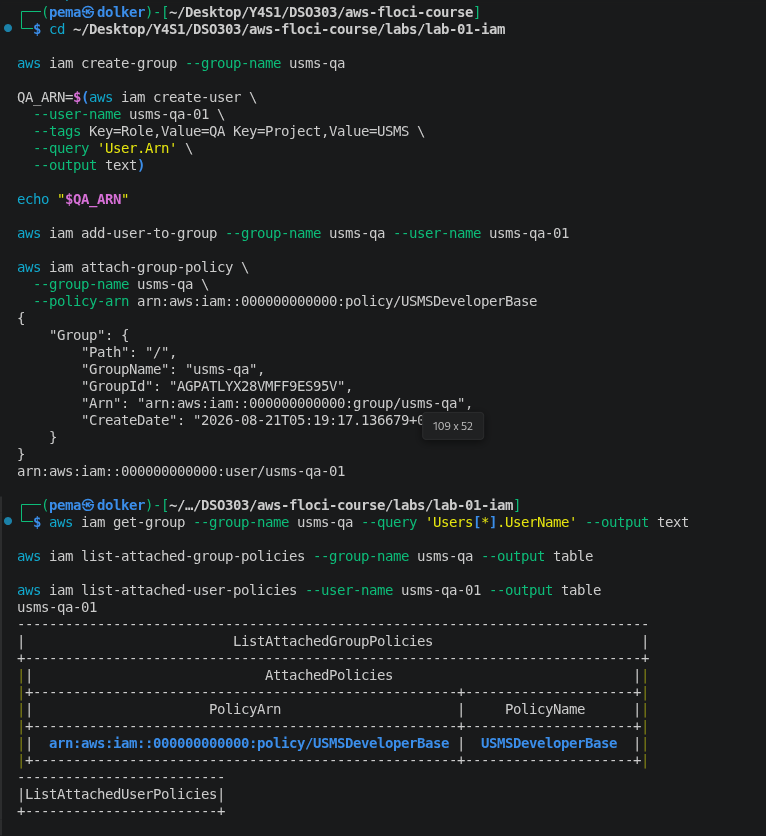
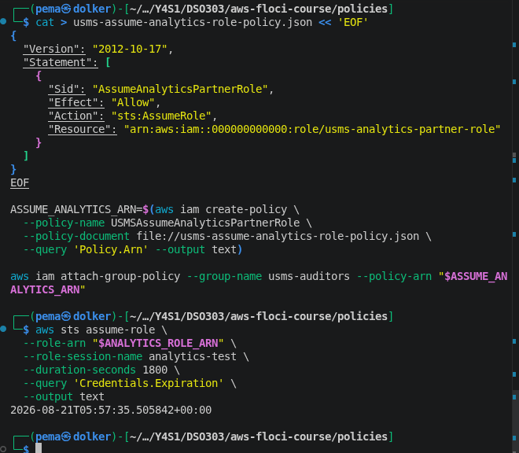
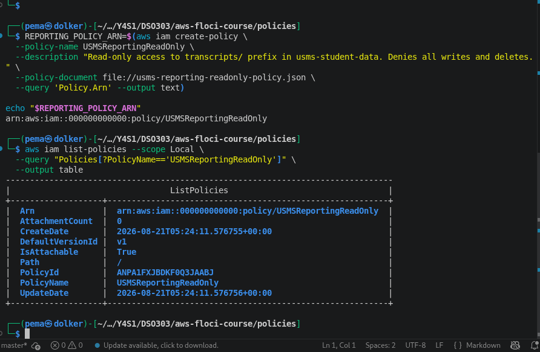
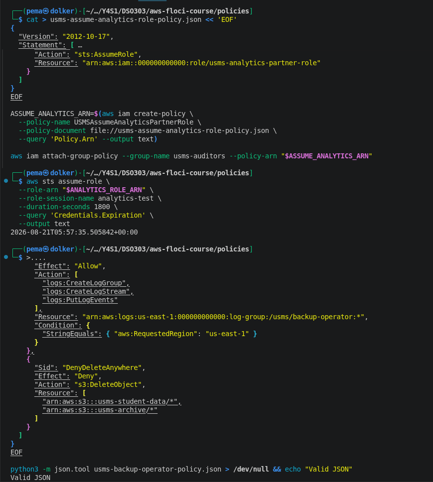
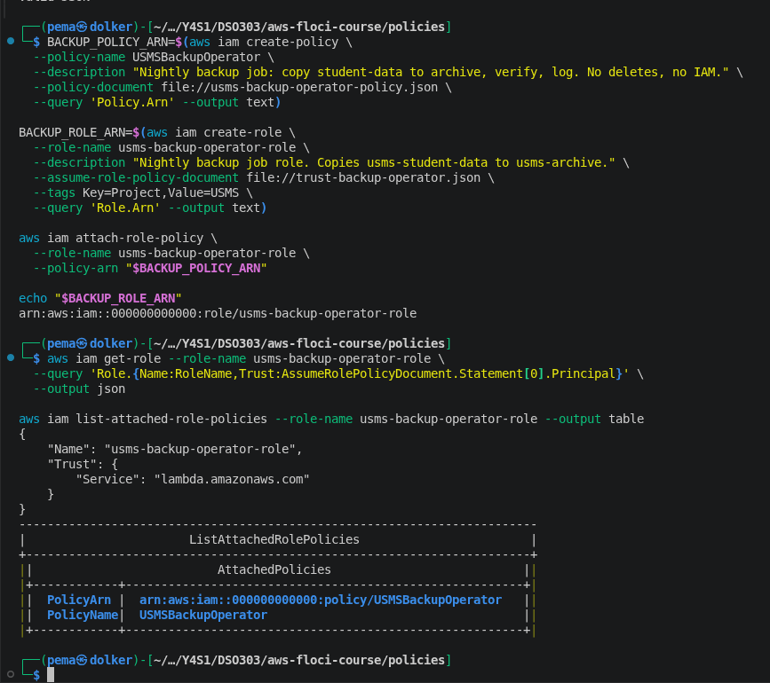
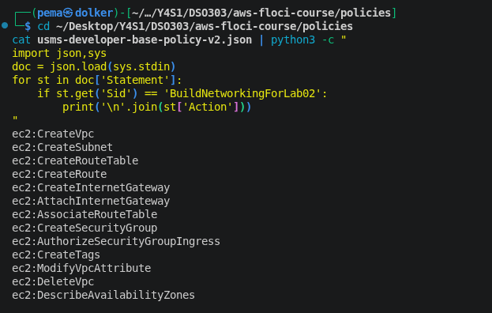
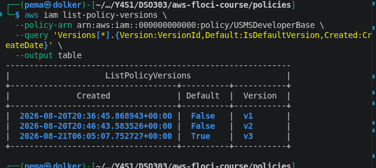
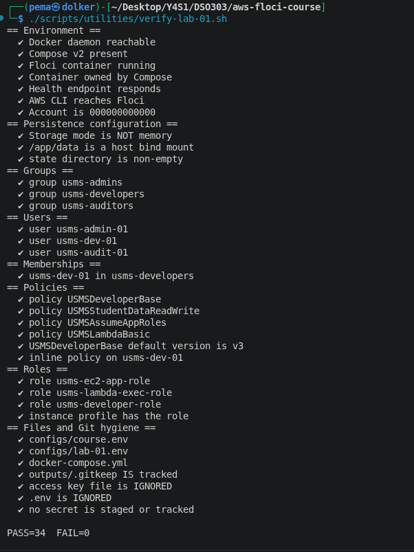

# Lab 1 - Independent Exercises Report  

**Course:** DSO303  
**Lab:** Lab 1 - IAM, Section 9 (Independent Lab Exercises) 
**Student:** Pema Dolker  
**Date:** 20/8/26

This document is a companion to the main Lab 1 report and covers the five independent
exercises in full detail: the reasoning behind each design decision, the exact commands
used, verification results, and reflection. All work was performed against the same Floci
environment built and verified in the main lab report.

---

## Exercise 1 - The QA Identity

### Objective
Create a new group `usms-qa` and a user `usms-qa-01` inside it, tagged appropriately, with
`USMSDeveloperBase` (an *existing* policy) attached to the **group**, not the user —
reinforcing that permissions should flow through group membership rather than direct
attachment.

### Design Reasoning
Reusing an existing policy rather than authoring a new one demonstrates that
`USMSDeveloperBase` was written generically enough to serve more than one team — QA
engineers, like developers, need to read infrastructure and build/inspect test resources,
so extending the same policy avoids duplicating logic.

### Implementation
```bash
aws iam create-group --group-name usms-qa

QA_ARN=$(aws iam create-user \
  --user-name usms-qa-01 \
  --tags Key=Role,Value=QA Key=Project,Value=USMS \
  --query 'User.Arn' \
  --output text)

aws iam add-user-to-group --group-name usms-qa --user-name usms-qa-01

aws iam attach-group-policy \
  --group-name usms-qa \
  --policy-arn arn:aws:iam::000000000000:policy/USMSDeveloperBase
```

### Results
| Check | Command | Result |
|---|---|---|
| User in group | `aws iam get-group --group-name usms-qa` | `usms-qa-01` present |
| Policy on group | `aws iam list-attached-group-policies --group-name usms-qa` | `USMSDeveloperBase` attached |
| Policy NOT on user | `aws iam list-attached-user-policies --user-name usms-qa-01` | Empty (correct) |



### Reflection
The empty result from `list-attached-user-policies` is not a failure — it's the expected,
correct outcome. This exercise made concrete the difference between a user's *direct*
policies and its *inherited* policies, which matters when auditing: checking only one of
these two places gives an incomplete picture of what a user can actually do.

---

## Exercise 2 - The Read-Only Reporting Policy

### Objective
Write a new customer managed policy, `USMSReportingReadOnly`, permitting reads only under
the `transcripts/` prefix of `usms-student-data`, with explicit denies on all write/delete
actions.

### Design Reasoning
Beyond the literal requirement, the `ListBucket` statement includes an `s3:prefix` condition
(`StringLike: transcripts/*`). Without it, a reporting identity could technically *list*
every object in the bucket — including files far outside its intended scope — even though it
could not *read* most of them. Restricting the listing itself, not just the reads, closes an
information-disclosure gap that a literal reading of the exercise would have missed.

### Implementation
```json
{
  "Version": "2012-10-17",
  "Statement": [
    {
      "Sid": "ListBucketTranscriptsOnly",
      "Effect": "Allow",
      "Action": "s3:ListBucket",
      "Resource": "arn:aws:s3:::usms-student-data",
      "Condition": { "StringLike": { "s3:prefix": "transcripts/*" } }
    },
    {
      "Sid": "ReadTranscripts",
      "Effect": "Allow",
      "Action": "s3:GetObject",
      "Resource": "arn:aws:s3:::usms-student-data/transcripts/*"
    },
    {
      "Sid": "NeverWriteOrDelete",
      "Effect": "Deny",
      "Action": ["s3:Put*", "s3:Delete*"],
      "Resource": [
        "arn:aws:s3:::usms-student-data",
        "arn:aws:s3:::usms-student-data/*"
      ]
    }
  ]
}
```
```bash
aws iam create-policy \
  --policy-name USMSReportingReadOnly \
  --description "Read-only access to transcripts/ prefix in usms-student-data. Denies all writes and deletes." \
  --policy-document file://usms-reporting-readonly-policy.json
```

### Results
`USMSReportingReadOnly` was created successfully (`AttachmentCount: 0` at creation, `v1`
default, `IsAttachable: True`).



### Reflection
This exercise reinforced the bucket-ARN-vs-object-ARN distinction from the main lab
(Step 23): `s3:ListBucket` must target the bucket ARN with no trailing `/*`, while
`s3:GetObject` must target the object ARN with `/*`. Writing the same mistake twice in one
lab (once correctly the first time, then deliberately checking it again here) helped cement
why this is called out as the single most common S3 policy error.

---

## Exercise 3 - The Third-Party Analytics Role

### Objective
Design a role `usms-analytics-partner-role` assumable by `usms-audit-01`, capped at 30
minutes per session, scoped to `arn:aws:s3:::usms-student-data/reports/*` only, tagged
`Project=USMS` and `External=true`.

### Design Reasoning and a Real Constraint Encountered
The first attempt set `--max-session-duration 1800` directly on the role, which **failed**:

```
Parameter validation failed:
Invalid value for parameter MaxSessionDuration, value: 1800, valid min value: 3600
```

AWS enforces a **1-hour (3600s) floor** on a role's own session-duration ceiling —
`MaxSessionDuration` cannot be set below that, even if the intended use case genuinely wants
shorter sessions. The correct interpretation is: set the role's ceiling to the permitted
minimum (3600s), and enforce the *actual* 30-minute limit at the point of assumption, via
`--duration-seconds 1800` on the `sts assume-role` call itself. The caller may always request
a session shorter than the role's ceiling.

### Implementation
```bash
# Trust policy — only usms-audit-01 may assume this role
cat > trust-analytics-partner.json << 'EOF'
{
  "Version": "2012-10-17",
  "Statement": [{
    "Sid": "AllowAuditorToAssume",
    "Effect": "Allow",
    "Principal": { "AWS": "arn:aws:iam::000000000000:user/usms-audit-01" },
    "Action": "sts:AssumeRole"
  }]
}
EOF

# Permissions policy — read-only, reports/ prefix only
cat > usms-analytics-partner-policy.json << 'EOF'
{
  "Version": "2012-10-17",
  "Statement": [{
    "Sid": "ReadReportsOnly",
    "Effect": "Allow",
    "Action": "s3:GetObject",
    "Resource": "arn:aws:s3:::usms-student-data/reports/*"
  }]
}
EOF

aws iam create-role \
  --role-name usms-analytics-partner-role \
  --assume-role-policy-document file://trust-analytics-partner.json \
  --max-session-duration 3600 \
  --tags Key=Project,Value=USMS Key=External,Value=true

# Second half of the handshake: usms-auditors must be permitted to call AssumeRole
aws iam attach-group-policy --group-name usms-auditors \
  --policy-arn <USMSAssumeAnalyticsPartnerRole ARN>

# Enforce the real 30-minute cap at assume time
aws sts assume-role \
  --role-arn <role ARN> \
  --role-session-name analytics-test \
  --duration-seconds 1800 \
  --query 'Credentials.Expiration' --output text
```

### Results
| Check | Result |
|---|---|
| Role's `MaxSessionDuration` | `3600` (the enforced floor) |
| Trust policy principal | `usms-audit-01` |
| Session actually granted | Expiration ≈ 30 minutes after the assume-role call time, confirming the shorter cap was honoured despite the role's own ceiling being 3600 |


*(Note: the earlier `MaxSessionDuration` validation error that prompted the fix to 3600 was
captured in the raw session log rather than a dedicated screenshot — see the "Design
Reasoning and a Real Constraint Encountered" section above for the exact error text.)*

### Reflection: `sts:ExternalId`
The exercise asked whether an `ExternalId` condition should be added to this role's trust
policy. `sts:ExternalId` exists specifically to prevent the **confused deputy problem** in
genuine cross-*account* trust relationships — where a single third party (e.g. a real SaaS
analytics vendor) is given one role ARN pattern that it reuses across many different
customers' AWS accounts. Without an ExternalId, a malicious customer could potentially trick
the third party into assuming a role belonging to a *different* customer than intended, by
supplying that other customer's role ARN.

In this exercise, the trust policy names a specific **in-account** IAM user
(`usms-audit-01`), not an external AWS account, so `ExternalId` is not strictly necessary
here. If this role were ever opened up to a genuine external AWS account instead, the trust
policy should be extended with:
```json
"Condition": { "StringEquals": { "sts:ExternalId": "<pre-shared-secret>" } }
```
and the partner would be required to pass `--external-id` on every `assume-role` call.

---

## Exercise 4 - Least-Privilege Design: The Backup Operator

### Objective
Design, from a plain-English job description, a policy for a nightly backup job that:
copies every object from `usms-student-data` into `usms-archive`, verifies what it copied,
writes a completion log line, never deletes anything, never reads IAM, and only operates in
`us-east-1` — using at most 4 statements and no wildcard `Action`/`Resource` on any `Allow`.

### Design Reasoning

**1. User, group, or role?**
A role, assumed by `lambda.amazonaws.com` — this is an automated, unattended job, and a role
means no permanent access key needs to sit in a scheduler configuration (mirrors the
reasoning behind `usms-ec2-app-role` in the main lab).

**2. What does "copy" actually require?**
This is the deliberate trap in the exercise: **there is no `s3:CopyObject` action.** A copy
is really two separate permissions on two separate resources — `s3:GetObject` on the source
object, and `s3:PutObject` on the destination object.

**3. What does "verify" require?**
`s3:GetObject` (and `s3:GetObjectAttributes`) on the *destination*, so the job can read back
what it just wrote and confirm it matches.

**4. Logging.**
The same three actions used for `usms-lambda-exec-role` in the main lab:
`logs:CreateLogGroup`, `logs:CreateLogStream`, `logs:PutLogEvents` — scoped to one specific
log group, not `logs:*`.

**5. "Never read IAM" and region restriction.**
Satisfied by omission (nothing in the policy touches `iam:*`, so it falls to implicit deny
automatically) and by an `aws:RequestedRegion` condition on every statement.

### Implementation
```json
{
  "Version": "2012-10-17",
  "Statement": [
    {
      "Sid": "ReadSourceBucketObjects",
      "Effect": "Allow",
      "Action": "s3:GetObject",
      "Resource": "arn:aws:s3:::usms-student-data/*",
      "Condition": { "StringEquals": { "aws:RequestedRegion": "us-east-1" } }
    },
    {
      "Sid": "WriteAndVerifyArchiveBucket",
      "Effect": "Allow",
      "Action": ["s3:PutObject", "s3:GetObject", "s3:GetObjectAttributes"],
      "Resource": "arn:aws:s3:::usms-archive/*",
      "Condition": { "StringEquals": { "aws:RequestedRegion": "us-east-1" } }
    },
    {
      "Sid": "WriteCompletionLog",
      "Effect": "Allow",
      "Action": ["logs:CreateLogGroup", "logs:CreateLogStream", "logs:PutLogEvents"],
      "Resource": "arn:aws:logs:us-east-1:000000000000:log-group:/usms/backup-operator:*",
      "Condition": { "StringEquals": { "aws:RequestedRegion": "us-east-1" } }
    },
    {
      "Sid": "DenyDeleteAnywhere",
      "Effect": "Deny",
      "Action": "s3:DeleteObject",
      "Resource": [
        "arn:aws:s3:::usms-student-data/*",
        "arn:aws:s3:::usms-archive/*"
      ]
    }
  ]
}
```

Exactly 4 statements. No `Action: "*"` or `Resource: "*"` on any `Allow` statement. The final
`Deny` statement is deliberate **defense-in-depth**: nothing in the first three statements
grants delete, but an explicit deny guarantees delete access can never be silently
reintroduced later without someone consciously removing this statement.

### Results
The role `usms-backup-operator-role` was created (trust: `lambda.amazonaws.com`) and
`USMSBackupOperator` was successfully attached.

**The completed policy document (logs statement and the explicit-deny guardrail):**


**Role creation and attachment:**


### Three Ways This Policy Could Still Be Abused

| # | Abuse vector | Fix |
|---|---|---|
| 1 | No object-key restriction on the archive bucket — `PutObject` is allowed on **any** key under `usms-archive/*`, not just a backup-specific prefix. A compromised job could overwrite unrelated archive files. | Scope `Resource` to a specific prefix, e.g. `arn:aws:s3:::usms-archive/nightly/*`, if that is the only path the job legitimately writes to. |
| 2 | No integrity/checksum enforcement — "verify" here only means "can read it back," not "matches a hash." A buggy job could silently write corrupted data and still pass its own check. | This is primarily an application-layer fix (the Lambda code should compare checksums/ETags), though the policy could additionally require server-side encryption headers via a `Condition` as a partial mitigation. |
| 3 | The trust policy allows **any** Lambda function in the account to assume this role, not just the intended backup function. | Add a `Condition` on the trust policy using `aws:SourceArn`, scoped to the specific backup Lambda function's ARN. |

### Reflection
This was the most demanding exercise because it required translating an informal job
description into precise IAM actions without guessing — discovering that `s3:CopyObject`
doesn't exist was the key insight, and it reframed "copy" correctly as two independent
`Allow` statements on two different resources. Writing the abuse-vector analysis afterward
was valuable: it's easy to consider a policy "done" once it technically satisfies the stated
requirements, but a genuinely least-privilege design requires actively looking for what the
policy *still* permits that it shouldn't.

---

## Exercise 5 - Preparing the Developer Identity for Lab 2

### Objective
Determine whether `usms-dev-01` already has every permission Lab 2 (VPC) will need; if not,
add exactly the missing actions as a new policy version (v3); update
`configs/lab-01.env` and the verification script accordingly.

### Method
Rather than relying solely on `simulate-principal-policy` (which, per the main lab report,
returned an unreliable `implicitDeny` for group-inherited permissions on this Floci build),
the actual v2 policy document was read back directly and compared line-by-line against Lab
2's full required action list:

```bash
cat usms-developer-base-policy-v2.json | python3 -c "
import json,sys
doc = json.load(sys.stdin)
for st in doc['Statement']:
    if st.get('Sid') == 'BuildNetworkingForLab02':
        print('\n'.join(st['Action']))
"
```

**v2 already contained:** `CreateVpc`, `CreateSubnet`, `CreateRouteTable`, `CreateRoute`,
`CreateInternetGateway`, `AttachInternetGateway`, `AssociateRouteTable`,
`CreateSecurityGroup`, `AuthorizeSecurityGroupIngress`, `CreateTags`, `ModifyVpcAttribute`,
`DeleteVpc`, `DescribeAvailabilityZones` (13 actions).

**Genuinely missing (2 actions):** `ec2:CreateNatGateway` and `ec2:AllocateAddress`. These
two belong together — a NAT gateway cannot be created without first allocating an Elastic IP
address for it, so both permissions were required as a pair, not independently.

### Implementation
```bash
python3 - << 'PY'
import json, pathlib
p = pathlib.Path("usms-developer-base-policy-v2.json")
doc = json.loads(p.read_text())
for st in doc["Statement"]:
    if st.get("Sid") == "BuildNetworkingForLab02":
        st["Action"] += ["ec2:CreateNatGateway", "ec2:AllocateAddress"]
pathlib.Path("usms-developer-base-policy-v3.json").write_text(json.dumps(doc, indent=2))
PY

aws iam create-policy-version \
  --policy-arn arn:aws:iam::000000000000:policy/USMSDeveloperBase \
  --policy-document file://usms-developer-base-policy-v3.json \
  --set-as-default

echo "export USMS_VPC_CIDR=10.0.0.0/16" >> configs/lab-01.env
```

The verification script's hard-coded expectation of `v2` as the default policy version was
also updated to `v3` — per the exercise's explicit instruction that "a verification script
that is never updated is a verification script nobody trusts."

### Results
| Check | Expected | Actual |
|---|---|---|
| `list-policy-versions` | v1 (False), v2 (False), v3 (True) | ✔ Matched exactly |
| No actions added beyond the required 2 | Only `CreateNatGateway` + `AllocateAddress` | ✔ Confirmed by diff against v2 |
| `USMS_VPC_CIDR` present in `configs/lab-01.env` | `10.0.0.0/16` | ✔ Present |
| `verify-lab-01.sh` updated and re-run | `PASS=34 FAIL=0` with the v3 check passing | ✔ Confirmed |

**The "before" state - reading back v2's 13 actions directly, to identify the gap by inspection rather than guessing:**


**The version bump — v1/v2/v3, with v3 now the default:**


**Final verification confirming the updated check passes:**


### Reflection
This exercise's most useful lesson was methodological rather than technical: when the
"official" verification tool (the policy simulator) gave an answer that didn't match direct
inspection of the underlying document, the correct response was to trust the primary source
(the actual JSON policy) over the tool, and to independently confirm the discrepancy rather
than assume either the tool or the policy was simply "wrong" without checking. This is the
same discipline real cloud engineers need when a monitoring dashboard and a raw log
disagree — reconcile against the source of truth, don't guess.

---

## Overall Summary

| Exercise | Core skill demonstrated |
|---|---|
| 1 — QA Identity | Reusing an existing policy across teams via group attachment, not duplication |
| 2 — Reporting Policy | Prefix-scoped conditions; closing an information-disclosure gap beyond the literal spec |
| 3 — Analytics Partner Role | Diagnosing and correctly resolving a real AWS parameter-validation constraint (`MaxSessionDuration` floor); reasoning about `sts:ExternalId` |
| 4 — Backup Operator | Translating a job description into precise least-privilege actions; discovering non-existent actions (`s3:CopyObject`); proactive abuse-vector analysis |
| 5 — Lab 2 Prep | Diff-based policy-gap analysis; distrusting an unreliable tool output in favour of direct source verification; maintaining a verification script as living documentation |

All five exercises were completed against the same environment verified in the main Lab 1
report, and the full 34-point verification script continued to pass (`PASS=34 FAIL=0`) after
all exercise work was completed.