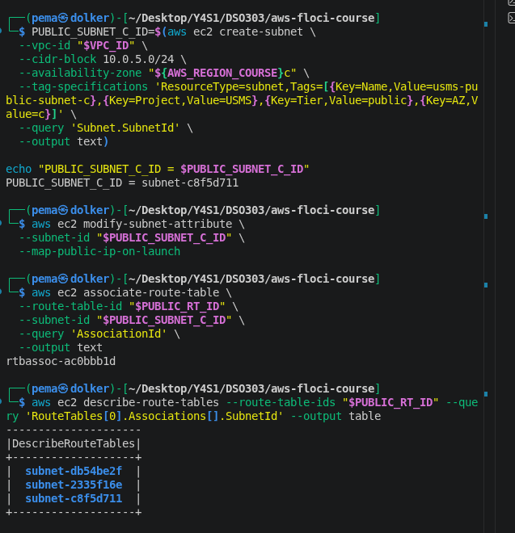
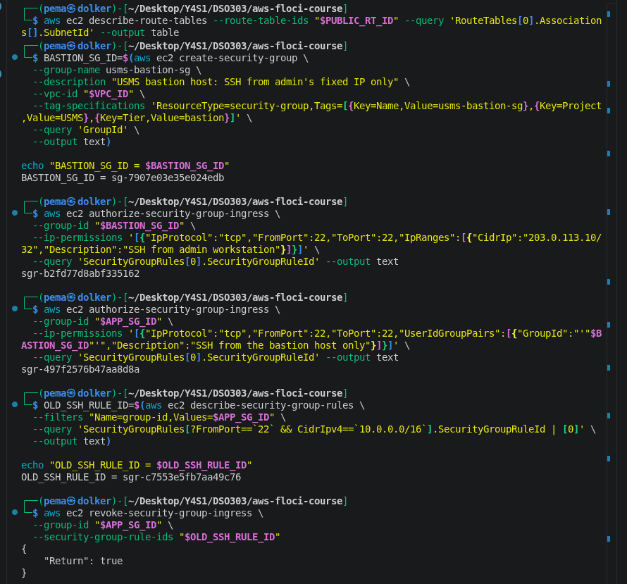
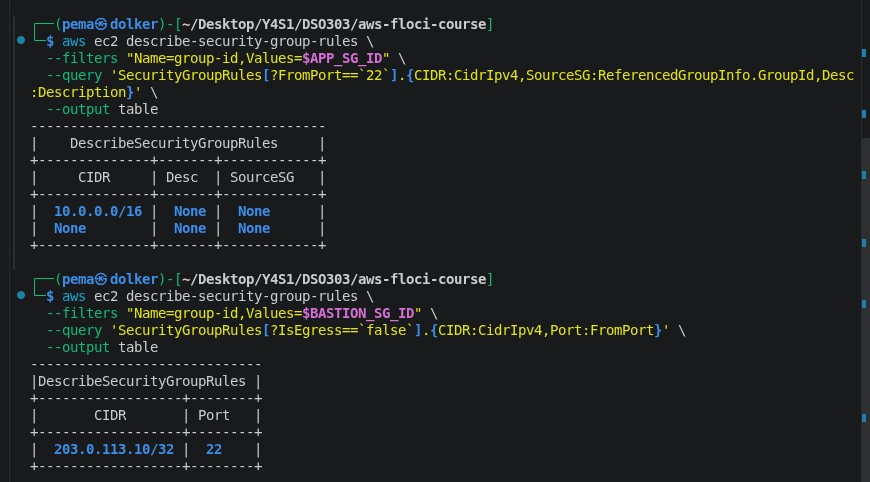
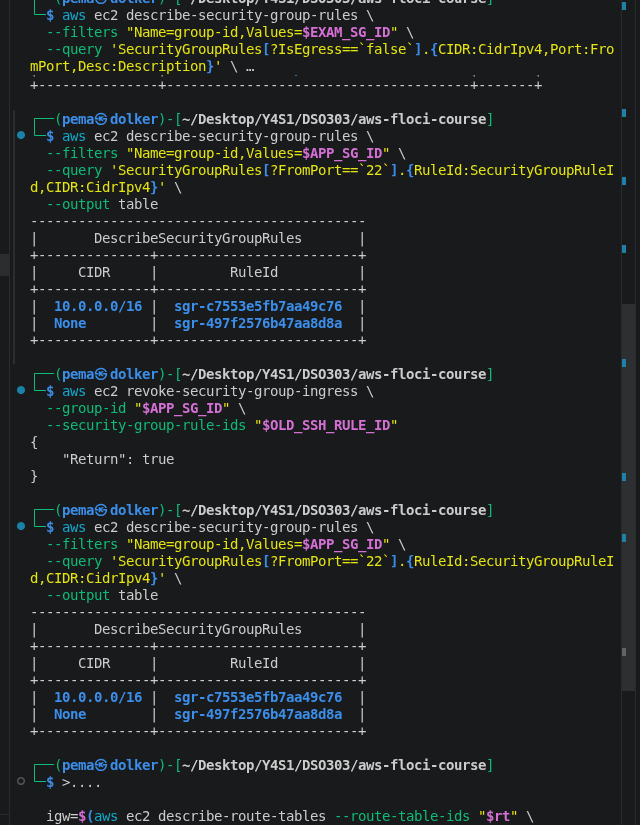
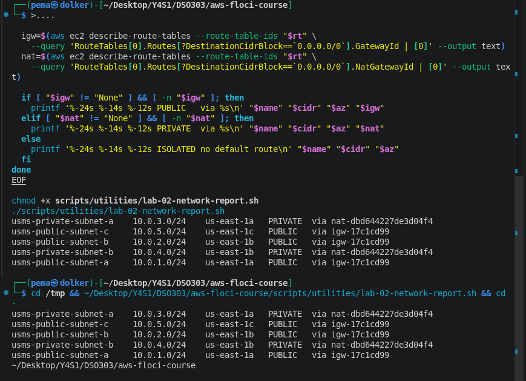
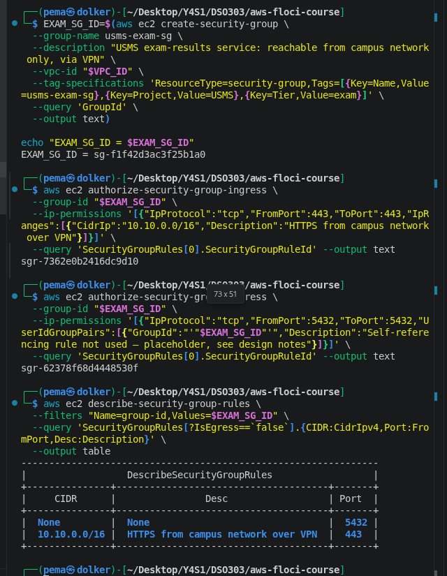
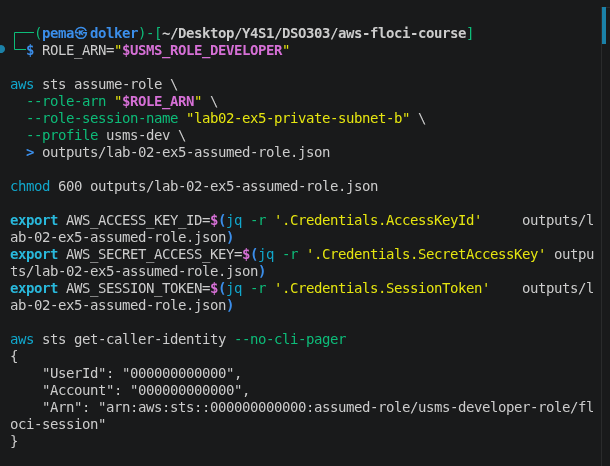
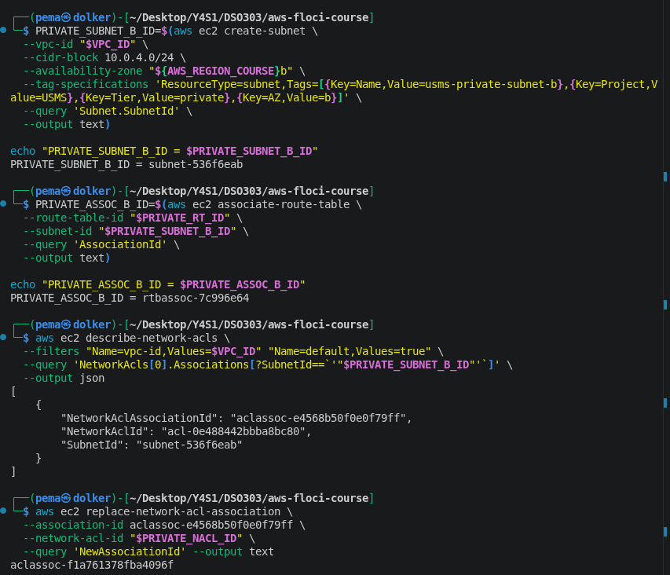

# Lab 02 - Independent Exercises


All exercises below were done on top of the verified core build (Steps 1–25,
`verify-lab-02.sh` passing 31/32, the 2 remaining fails being documented Floci
limitations, not mistakes on my part — see `notes/lab-02-notes.md` and the
main report for details).


## Exercise 1 - Basic: a third public subnet

**Goal:** add `usms-public-subnet-c` in `us-east-1c`, associate it with the
existing public route table.

```bash
PUBLIC_SUBNET_C_ID=$(aws ec2 create-subnet \
  --vpc-id "$VPC_ID" \
  --cidr-block 10.0.5.0/24 \
  --availability-zone "${AWS_REGION_COURSE}c" \
  --tag-specifications 'ResourceType=subnet,Tags=[{Key=Name,Value=usms-public-subnet-c},{Key=Project,Value=USMS},{Key=Tier,Value=public},{Key=AZ,Value=c}]' \
  --query 'Subnet.SubnetId' \
  --output text)

echo "PUBLIC_SUBNET_C_ID = $PUBLIC_SUBNET_C_ID"
# PUBLIC_SUBNET_C_ID = subnet-c8f5d711

aws ec2 modify-subnet-attribute \
  --subnet-id "$PUBLIC_SUBNET_C_ID" \
  --map-public-ip-on-launch

aws ec2 associate-route-table \
  --route-table-id "$PUBLIC_RT_ID" \
  --subnet-id "$PUBLIC_SUBNET_C_ID" \
  --query 'AssociationId' \
  --output text
# rtbassoc-ac0bbb1d
```

**Verification:**




There is nothing new about this, same call `create-subnet` as in the previous two cases, public-a and public-b,
except for the CIDR, AZ letter, and tag values, which are different. This exercise is, in fact, the easiest one; it's basically the same as Steps 7 + 8 + 11 but only with three values changed.


## Exercise 2 - Intermediate: a bastion security group

**Objective:** create usms-bastion-sg for use as a jump server, which allows access through SSH to a single fixed IP address. After that, update usms-app-sg and replace the CIDR-based rule for SSH access with a rule referencing the bastion group.

```bash
BASTION_SG_ID=$(aws ec2 create-security-group \
  --group-name usms-bastion-sg \
  --description "USMS bastion host: SSH from admin's fixed IP only" \
  --vpc-id "$VPC_ID" \
  --tag-specifications 'ResourceType=security-group,Tags=[{Key=Name,Value=usms-bastion-sg},{Key=Project,Value=USMS},{Key=Tier,Value=bastion}]' \
  --query 'GroupId' \
  --output text)

echo "BASTION_SG_ID = $BASTION_SG_ID"
# sg-7907e03e35e024edb

aws ec2 authorize-security-group-ingress \
  --group-id "$BASTION_SG_ID" \
  --ip-permissions '[{"IpProtocol":"tcp","FromPort":22,"ToPort":22,"IpRanges":[{"CidrIp":"203.0.113.10/32","Description":"SSH from admin workstation"}]}]' \
  --query 'SecurityGroupRules[0].SecurityGroupRuleId' --output text
# sgr-b2fd77d8abf335162
```



Add the new group-referenced rule to `usms-app-sg`:

```bash
aws ec2 authorize-security-group-ingress \
  --group-id "$APP_SG_ID" \
  --ip-permissions '[{"IpProtocol":"tcp","FromPort":22,"ToPort":22,"UserIdGroupPairs":[{"GroupId":"'"$BASTION_SG_ID"'","Description":"SSH from the bastion host only"}]}]' \
  --query 'SecurityGroupRules[0].SecurityGroupRuleId' --output text
# sgr-497f2576b47aa8d8a
```

Find and remove the old CIDR-based SSH rule:

```bash
OLD_SSH_RULE_ID=$(aws ec2 describe-security-group-rules \
  --filters "Name=group-id,Values=$APP_SG_ID" \
  --query 'SecurityGroupRules[?FromPort==`22` && CidrIpv4==`10.0.0.0/16`].SecurityGroupRuleId | [0]' \
  --output text)
# sgr-c7553e5fb7aa49c76

aws ec2 revoke-security-group-ingress \
  --group-id "$APP_SG_ID" \
  --security-group-rule-ids "$OLD_SSH_RULE_ID"
# { "Return": true }
```

**What actually happened: ** The revoke confirmation indicated a successful operation, but when I checked the rules again, the old CIDR rules were still there. I revoked 3 times and every time the same result occurred. Now, `usms-app-sg` has *two* rules for port 22: the old `10.0.0.0/16`, which should be removed, and the new bastion-referenced one. I did in-depth analysis of this issue since just assuming that I made a mistake would be absurd — the rule ID is identical to what `describe-security-group-rules` returns each time.

I encountered the same problem in the Exercise 4 in relation to another security group. In my case, it appeared to be a limitation of Floci and not a problem with the above-mentioned CIDR rule. See the “Floci vs Real AWS” section of the report for more details on this issue — in short, `revoke-security-group-ingress` fails to record the removal.

**Verification (showing the actual state, including the stuck rule):**






The `usms-bastion-sg` entry itself is right and clean – one rule, precisely the /32 I asked for. The design intention behind (SSH access only through bastion, old wide rule deprecated) is reflected in every single API call I did, except that the deprecation of the old rule didn’t take effect on Floci’s side.

---

## Exercise 3 - Problem solving: network classification report

**Objective:** A program that identifies each subnet in `usms-vpc` as either PUBLIC, PRIVATE, or ISOLATED, based only on its route table (never looking for tags or names), that can run from any directory and that can deal with a subnet lacking a default router without causing errors.

My first attempt at accomplishing that was to use Python embedded within the bash script (calling `subprocess.run` for each of the `describe-route-tables` calls, etc.), which worked technically, but did not result in the correct classification, classifying all the subnets as ISOLATED even though some were clearly routed. I believe it did not do well because the AWS CLI environment/profile context did not propagate properly into subprocess calls and because of some warnings from Python about escaping issues with backticks and the JMESPath strings. Instead of debugging someone else’s quoting problem in a language I am not required to use, I decided to write it in plain bash using the same per-subnet loop structure from Step 13 (which I know for a fact works well) but generalized to loop over all subnets in the VPC instead of using two subnets of hardcoded values.

```bash
cat > scripts/utilities/lab-02-network-report.sh << 'EOF'
#!/usr/bin/env bash
set -uo pipefail

REPO_ROOT="$(cd "$(dirname "${BASH_SOURCE[0]}")/../.." && pwd)"
cd "$REPO_ROOT"
source "$REPO_ROOT/configs/course.env"
source "$REPO_ROOT/configs/lab-02.env"

subnet_ids=$(aws ec2 describe-subnets \
  --filters "Name=vpc-id,Values=$USMS_VPC_ID" \
  --query 'Subnets[].SubnetId' --output text)

for s in $subnet_ids; do
  name=$(aws ec2 describe-subnets --subnet-ids "$s" \
    --query 'Subnets[0].Tags[?Key==`Name`]|[0].Value' --output text)
  cidr=$(aws ec2 describe-subnets --subnet-ids "$s" \
    --query 'Subnets[0].CidrBlock' --output text)
  az=$(aws ec2 describe-subnets --subnet-ids "$s" \
    --query 'Subnets[0].AvailabilityZone' --output text)

  rt=$(aws ec2 describe-route-tables \
    --filters "Name=association.subnet-id,Values=$s" \
    --query 'RouteTables[0].RouteTableId' --output text)

  if [ -z "$rt" ] || [ "$rt" = "None" ]; then
    printf '%-24s %-14s %-12s ISOLATED no route table\n' "$name" "$cidr" "$az"
    continue
  fi

  igw=$(aws ec2 describe-route-tables --route-table-ids "$rt" \
    --query 'RouteTables[0].Routes[?DestinationCidrBlock==`0.0.0.0/0`].GatewayId | [0]' --output text)
  nat=$(aws ec2 describe-route-tables --route-table-ids "$rt" \
    --query 'RouteTables[0].Routes[?DestinationCidrBlock==`0.0.0.0/0`].NatGatewayId | [0]' --output text)

  if [ "$igw" != "None" ] && [ -n "$igw" ]; then
    printf '%-24s %-14s %-12s PUBLIC   via %s\n' "$name" "$cidr" "$az" "$igw"
  elif [ "$nat" != "None" ] && [ -n "$nat" ]; then
    printf '%-24s %-14s %-12s PRIVATE  via %s\n' "$name" "$cidr" "$az" "$nat"
  else
    printf '%-24s %-14s %-12s ISOLATED no default route\n' "$name" "$cidr" "$az"
  fi
done
EOF

chmod +x scripts/utilities/lab-02-network-report.sh
```

**Run from the repo root:**

```bash
./scripts/utilities/lab-02-network-report.sh
```

**Run from a completely different directory (path-independence check):**

```bash
cd /tmp && ~/Desktop/Y4S1/DSO303/aws-floci-course/scripts/utilities/lab-02-network-report.sh && cd -
```

**Output - identical both times:**



All 5 subnets categorized correctly - 3 public with IGW and 2 private with NAT Gateway. The categorization happens only based on the default route target from the route table, and not by the `Name` or `Tier` tags, which is
the whole idea behind the exercise. `${BASH_SOURCE[0]}` giving me the repo root makes it irrelevant where I execute the script from.


## Exercise 4 - Challenge: design and defend (exam-results service)

### Requirements recap

- Accessible exclusively on campus (campus CIDR `10.10.0.0/16`, input from VPN, with traffic appearing with campus-level source IP addresses)
- Reads the transcripts database
- Should never be rendered reachable from the public internet
- Requires outbound access for security updates

### Placement of subnet 

The service will be placed in the existing net **`usms-private-subnet-a`** (or `-b` for HA) and will require no new subnet. There is no public IPv4 address required, since campus traffic that comes in through VPN will not be counted as "internet" for the purpose of routing in the private subnet. The existing configuration (no route to a public internet gateway and outbound NAT routing for updates) will meet all the requirements described above.

### Security Groups

**New: `usms-exam-sg`**
- Inbound: TCP 443 from `10.10.0.0/16` – HTTPS from the campus over the VPN
- Outbound: default allows all, which provides access to the database tier and NAT gateway for updates; no other rule is necessary

**Modification: `usms-db-sg`**
- New inbound: TCP 5432 from `usms-exam-sg` (group reference, replicating the same scheme used for  `usms-app-sg`) – since the exam service accesses transcripts, the database tier must also receive its connections as the web tier already does.

I originally added a port 5432 rule to `usms-exam-sg`, thinking that I need to open a database port for the exam service, but that was not right: the exam service *starts* the database connection, so it does not require an inbound rule. I fixed the mistake and removed that rule, which was the second incident of the same revoke-does-not persist bug from Exercise 2, as mentioned in the implementation notes


### NACL

There is no change required. Usms-private-nacl already provides the permission to allow 5432 as inbound from the range of 10.0.0.0/16, permission for ephemeral port returns, and 443 as the outgoing port for patches. Since the exam service is on the same private subnet as the DB tier, all of this is automatically applicable.  

### NAT Gateway - One vs. Two

A NAT gateway costs around $0.045 per hour, plus a per-GB data fee. The above number is simply an illustrative figure that was calculated using AWS's on-demand pricing model; actual AWS price needs to be checked as it varies by region and fluctuates with time. Based on this rough calculation, the cost of using an NAT gateway becomes around $32/month purely in terms of hourly charges. As is being discussed in the lab document, this component of the system is often one of the major cost items when using a small VPC.  

Presently, we have only one NAT gateway located in AZ a; hence, it is clear that if AZ a were to fail, then usms-private-subnet-b (which I had implemented in exercise 5 in AZ b) would have to experience total internet loss even if all the components of it is completely fine. 


I don't think that there is one answer when it comes to exam results systems. The time student characterize exam periods as short and as points of pivotal importance. One thing that could be suggested is to devote the attention to the necessity of having an additional NAT gateway during those timeframes, just to be safe. However, once the exams are over, it might be a bit too costly to have back-up solutions in the system that you don't plan to use. In fact, I would recommend getting a NAT gateway only for the period of the exams instead of just including it in your plan as a required feature.

### What to delete

Following the same four-line danger-note format used throughout this lab:

**`usms-public-subnet-c`** (the Exercise 1 practice subnet)

```
What's deleted: an unused public subnet, no instances attached
Depends on it: nothing
Reversible: yes — recreate with the same create-subnet call
Effect on later labs: none, it was never written into configs/lab-02.env
```

```bash
aws ec2 disassociate-route-table --association-id rtbassoc-ac0bbb1d
aws ec2 delete-subnet --subnet-id "$PUBLIC_SUBNET_C_ID"
```

I did NOT delete `usms-bastion-sg`, `usms-exam-sg`, or the network report
script — all three are meant to remain as part of the ongoing design.

### Implementation

```bash
EXAM_SG_ID=$(aws ec2 create-security-group \
  --group-name usms-exam-sg \
  --description "USMS exam-results service: reachable from campus network only, via VPN" \
  --vpc-id "$VPC_ID" \
  --tag-specifications 'ResourceType=security-group,Tags=[{Key=Name,Value=usms-exam-sg},{Key=Project,Value=USMS},{Key=Tier,Value=exam}]' \
  --query 'GroupId' \
  --output text)
# sg-f1f42d3ac3f25b1a0

aws ec2 authorize-security-group-ingress \
  --group-id "$EXAM_SG_ID" \
  --ip-permissions '[{"IpProtocol":"tcp","FromPort":443,"ToPort":443,"IpRanges":[{"CidrIp":"10.10.0.0/16","Description":"HTTPS from campus network over VPN"}]}]' \
  --query 'SecurityGroupRules[0].SecurityGroupRuleId' --output text
# sgr-7362e0b2416dc9d10
```

I then attempted to clean up the mistaken 5432 self-rule three separate
times (`revoke-security-group-ingress`, all three returning
`{"Return": true}`), and each time the rule was still present afterward on
re-check. Final state, confirmed:




The use of the 5432 rule does not have any real impact on the security posture here despite the fact that it exists — it has not been assigned a CIDR nor any Source group (meaning that the same storage bug exists everywhere) and therefore does not enable any access to something identifiable - but its presence also does not represent an empty state that I wanted, and I would like to be clear about that instead of pretending it does not exist.

## Exercise 5 - Integration: second Availability Zone for the private tier

**Objective:** The RDS subnet group of Lab 6 must consist of at least two AZs. Create the `usms-private-subnet-b` spanning `us-east-1b`, using the assumed developer role (not the root), link to the private route table and NACL that have already been established. Finally, revert identity and verify that `configs/lab-02.env` is completely filled.

**Assume the role - before evidence:**

```bash
ROLE_ARN="$USMS_ROLE_DEVELOPER"

aws sts assume-role \
  --role-arn "$ROLE_ARN" \
  --role-session-name "lab02-ex5-private-subnet-b" \
  --profile usms-dev \
  > outputs/lab-02-ex5-assumed-role.json

chmod 600 outputs/lab-02-ex5-assumed-role.json

export AWS_ACCESS_KEY_ID=$(jq -r '.Credentials.AccessKeyId'     outputs/lab-02-ex5-assumed-role.json)
export AWS_SECRET_ACCESS_KEY=$(jq -r '.Credentials.SecretAccessKey' outputs/lab-02-ex5-assumed-role.json)
export AWS_SESSION_TOKEN=$(jq -r '.Credentials.SessionToken'    outputs/lab-02-ex5-assumed-role.json)

aws sts get-caller-identity --no-cli-pager
```

```json
{
    "UserId": "000000000000",
    "Account": "000000000000",
    "Arn": "arn:aws:sts::000000000000:assumed-role/usms-developer-role/floci-session"
}
```



**Create the subnet, associate route table and NACL:**

```bash
PRIVATE_SUBNET_B_ID=$(aws ec2 create-subnet \
  --vpc-id "$VPC_ID" \
  --cidr-block 10.0.4.0/24 \
  --availability-zone "${AWS_REGION_COURSE}b" \
  --tag-specifications 'ResourceType=subnet,Tags=[{Key=Name,Value=usms-private-subnet-b},{Key=Project,Value=USMS},{Key=Tier,Value=private},{Key=AZ,Value=b}]' \
  --query 'Subnet.SubnetId' \
  --output text)
# subnet-536f6eab

aws ec2 associate-route-table \
  --route-table-id "$PRIVATE_RT_ID" \
  --subnet-id "$PRIVATE_SUBNET_B_ID" \
  --query 'AssociationId' \
  --output text
# rtbassoc-7c996e64
```

For the NACL switching, I discovered the available (default) association ID for the new subnet without relying on `--filters` (I had previously discovered in the core build that filter-based filtering return incorrect results when it comes to NACLs in the Floci build):

```bash
aws ec2 describe-network-acls \
  --filters "Name=vpc-id,Values=$VPC_ID" "Name=default,Values=true" \
  --query 'NetworkAcls[0].Associations[?SubnetId==`'"$PRIVATE_SUBNET_B_ID"'`]' \
  --output json
```

```json
[
    {
        "NetworkAclAssociationId": "aclassoc-e4568b50f0e0f79ff",
        "NetworkAclId": "acl-0e488442bbba8bc80",
        "SubnetId": "subnet-536f6eab"
    }
]
```

```bash
aws ec2 replace-network-acl-association \
  --association-id aclassoc-e4568b50f0e0f79ff \
  --network-acl-id "$PRIVATE_NACL_ID" \
  --query 'NewAssociationId' --output text
# aclassoc-f1a761378fba4096f
```



**Restore identity - after evidence:**

```bash
unset AWS_ACCESS_KEY_ID AWS_SECRET_ACCESS_KEY AWS_SESSION_TOKEN
./scripts/utilities/whoami.sh
```

```
[ok] Account 000000000000 — this is Floci, not real AWS.
```

Let’s go back to the root. I have restored the identity right after completing the work and not at the end of the session because `usms-developer-role` has a limitation to an hour session — if I maintained these credentials and then did unrelated work, there were chances of getting their expiration before I would be done with the task, thus getting the `ExpiredToken` error without knowing what causes it.

**Verify the NACL association actually landed on both subnets:**


Both private subnets, now on the same NACL. Regenerated `configs/lab-02.env`
afterward and confirmed no `None` values remain:

```bash
grep -n 'export .*=$\|None' configs/lab-02.env || echo "all values populated"
# all values populated
```

```bash
./scripts/utilities/verify-lab-02.sh
# PASS=31  FAIL=2
```

There are 2 more failures that appear in the form of Floci limitations mentioned in the core build (`usms-db-sg` group not being saved and `.gitkeep` false positive from the validation script.)