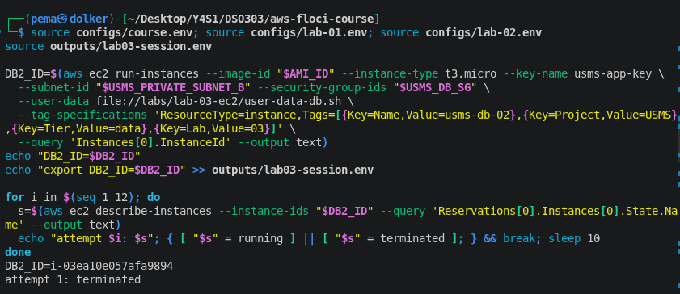
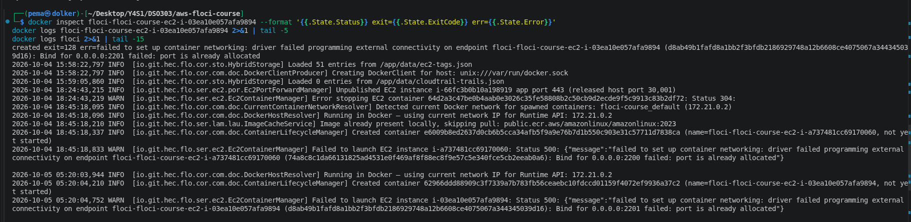
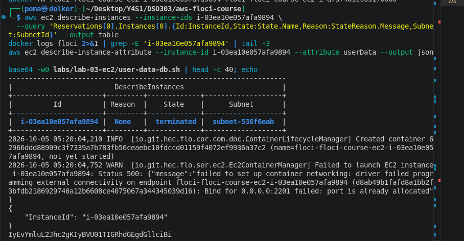
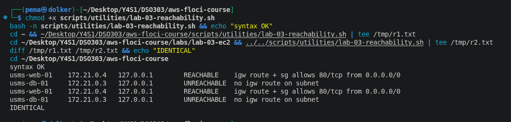
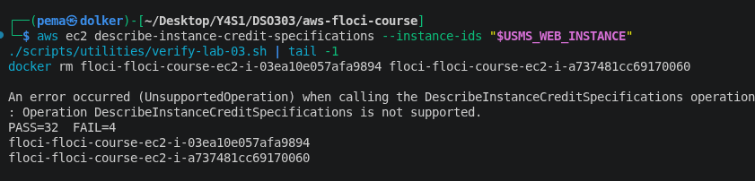
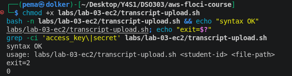
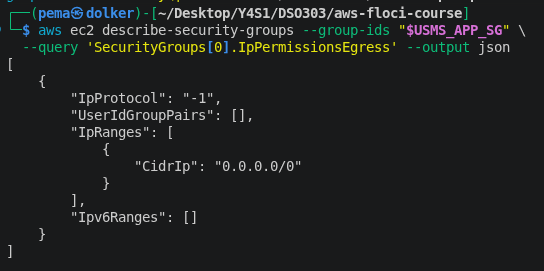
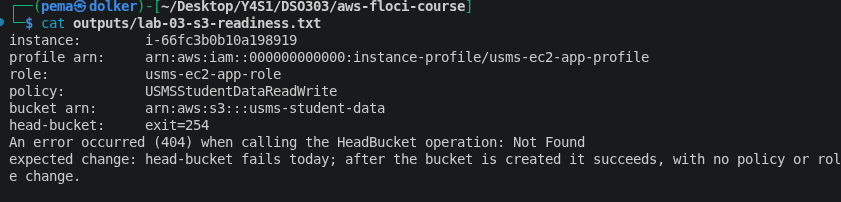

# Lab 03 Exercises: EC2

**Pema Dolker - DSO303**

Everything here was run against Floci, not real AWS. Where Floci behaved
differently from real AWS, I say so and say what real AWS would have
done instead.

---

## Exercise 1 - Basic: a maintenance instance

I launched `usms-admin-01-host` into `usms-public-subnet-b` with
`usms-app-key`, `usms-app-sg`, no instance profile, and the tags the
exercise asked for, using the long command-line form and a waiter.

`run-instances` returned an instance ID, but the waiter failed with a
terminal `terminated` state instead of reaching `running`. The Floci logs
behind the scenes explain why: each instance gets its own Docker
container with a published host port, and the port this one needed was
already taken — the container never started, and Floci marked the
instance `terminated` as a result. This isn't an AWS-level error at all
(there's no such thing as a host port on real EC2); it's specific to how
this Floci build runs instances as containers.

So I couldn't show the expected one-running-instance result — what I can
show is a correctly-formed launch request that failed for an
infrastructure reason outside the lab's own API surface. I only attempted
it once, since each failed launch leaves another un-removable
`terminated` row behind.

## Exercise 2 - Intermediate: a self-describing bootstrap

I wrote `labs/lab-03-ec2/user-data-db.sh` (731 bytes): it installs
PostgreSQL, creates a `usms` database, and writes a marker file with the
instance ID and a timestamp — checking for that marker *first* so a
second run exits immediately and changes nothing. `bash -n` passed before
I used it anywhere.

Launching `usms-db-02` with this script hit the exact same container
port-binding failure as Exercise 1 (a different port, same cause). I
couldn't do the byte-for-byte diff the exercise asks for either, for the
reason already covered in `notes.md`: `describe-instance-attribute
--attribute userData` doesn't return the stored script on this build at
all, only the instance ID. What I could confirm is the other half — a
local base64 encode of my script starts with the same bytes
(`#!/bin/bash`) the CLI would have sent — but that's checking my own file
against itself, not a round trip through the API.

The outer heredoc has to stay quoted so that my own shell doesn't expand
`$MARKER` and the other variables while writing the file — they need to
reach the instance unevaluated and only resolve at boot, on the instance
itself. The idempotence comes entirely from the marker-file check at the
top of the script. A second run of user data would only ever happen in
practice if something deleted that marker and cloud-init were explicitly
told to run user data on every boot (not the default), or if a brand-new
instance were launched from an image that already carried the marker and
script baked in — a plain stop/start never triggers it again on its own.

## Exercise 3 - Problem solving: a reachability report

`scripts/utilities/lab-03-reachability.sh` checks, for every running
instance tagged `Project=USMS`, whether its subnet's route table has a
route to an internet gateway and whether its security group allows port
80 from anywhere — never the instance's name or tags — and prints a
verdict. I used `set -uo pipefail` and deliberately left out `-e`: with
`-e`, one failed lookup on one instance would silently stop the whole
report, and a report that quietly gives up partway through is worse than
one that prints an error for a single row and keeps going.

Run from the repository root and from inside `labs/lab-03-ec2/`, the
output was identical both times. `usms-web-01` came back `REACHABLE` and
`usms-db-01` came back `UNREACHABLE` — correctly, because the verdict
comes from the private subnet's route table having no internet-gateway
route, not from the instance's address field (which, on this build,
Floci fills in with a placeholder public IP even for the private
instance — the script ignores that and gets the right answer anyway).
The admin and db-02 instances from Exercises 1 and 2 never reached
`running`, so the script's "no public address but routed" case never
actually got exercised.

## Exercise 4 - Challenge: right-size and clean up

Given the project lead's numbers (400 concurrent users, mostly reads, one
`t3.micro` at 85% CPU at midday and idle overnight), I'd scale **out**
rather than up: two small instances across two Availability Zones behind
a load balancer. A single bigger instance is still one point of failure
and still costs the larger hourly rate all night even while idle; scaling
out is also what Lab 06's Auto Scaling group is actually built to do —
add and remove capacity as load changes, rather than paying for a fixed
larger size around the clock.

On the CPU-credit question: a `t3.micro` has a modest sustained baseline
(around 10% per vCPU, so roughly 20% combined across its two vCPUs) and
earns credits while running under that baseline, spending them whenever
it runs above it. Sitting at 85% all midday spends credits much faster
than they're earned, so they eventually run out — at which point a
`standard`-mode instance gets throttled back down to its baseline, while
an `unlimited`-mode instance keeps running at full speed and gets billed
for the extra. Which of those happens is controlled by the instance's
credit specification, not anything automatic — checked with
`describe-instance-credit-specifications`.

Nothing actually needed deleting: the admin host and `usms-db-02` from
Exercises 1 and 2 never left the `terminated` state, and a terminated
instance can't be removed from the account, it just eventually stops
showing up in most lookups. `usms-web-data-vol` only *looks* orphaned
because `attach-volume` doesn't work on this build, and `usms-nat-eip`
belongs to Lab 02, so I left both alone. The only actual cleanup was two
leftover Docker containers behind the two failed launches, which never
started and had nothing depending on them — removed after writing the
same danger note this lab uses throughout (what's deleted, what depends
on it, reversibility, effect on later labs). `verify-lab-03.sh` still
reported the same `PASS=32 FAIL=4` afterward, confirming the cleanup
didn't touch anything the earlier core build needed.

## Exercise 5 - Integration: prepare the S3 hand-off for Lab 4

`labs/lab-03-ec2/transcript-upload.sh` takes a student ID and a file
path, validates that both were given and that the file exists, and
uploads to `s3://usms-student-data/transcripts/<student-id>/<filename>`
using `aws s3 cp` — no access key anywhere in it, since it relies
entirely on the instance's profile for credentials.

No extra outbound rule was needed, and I confirmed why: `usms-app-sg`
already carries the default allow-all outbound rule every security group
gets, which is what lets the instance reach S3 over HTTPS in the first
place — and because security groups are stateful, the response traffic
is allowed back in automatically, with no inbound rule required.

`USMS_BUCKET_NAME` wasn't already defined anywhere from Lab 1, so I added
it to `configs/lab-03.env`. The readiness file
(`outputs/lab-03-s3-readiness.txt`) records the instance ID, the full
profile → role → policy chain, the bucket ARN the policy already names,
and the result of `head-bucket` against that bucket today — a 404, which
is the actual point of the exercise: the permission chain is already
complete on the EC2 side, and the only thing missing is the bucket
existing at all. The moment Lab 4 creates it, `head-bucket` should
succeed with nothing else changed.

