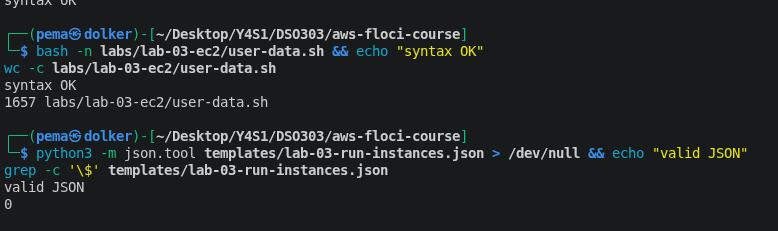
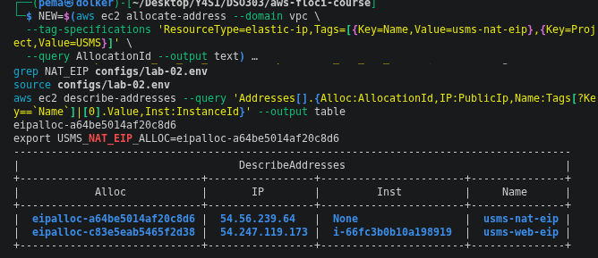
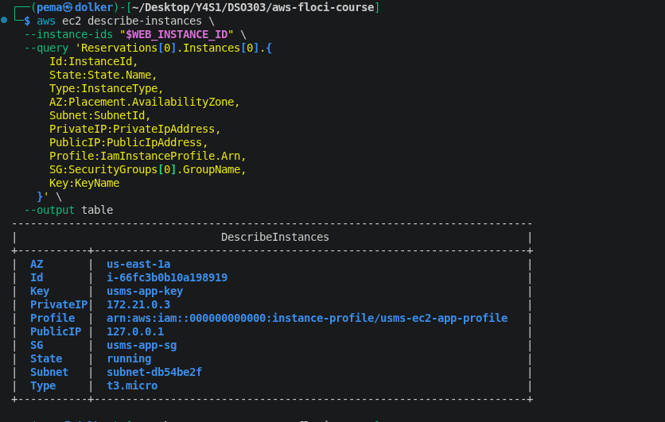
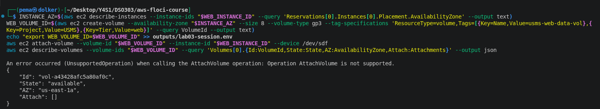
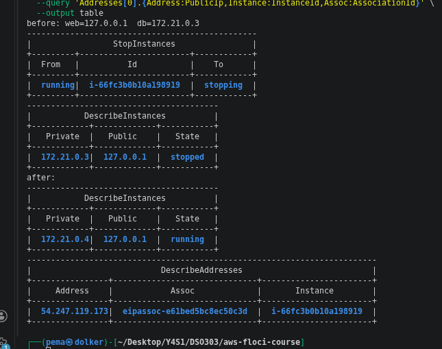
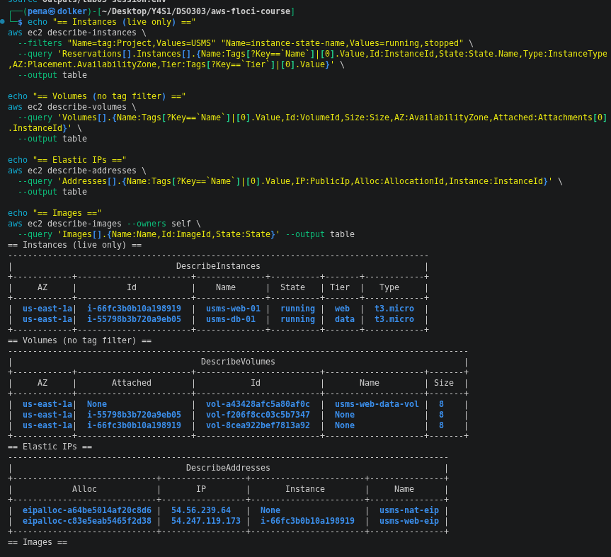
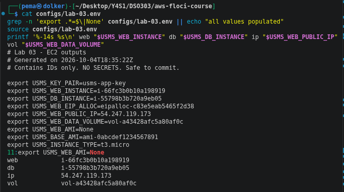

# AWS Practical Laboratory Report

**Student Name:** Pema Dolker   
**Module:** DSO303    
**Practical:** Lab 03 - Amazon EC2 and Deploying the USMS Application   
**Environment:** Floci (local AWS API emulator, Docker Compose, hybrid storage mode)

---

## 1. Aim / Objective

Lab 02 built a network with nothing running in it. This practical put the
USMS application into that network: a web server in the public subnet
carrying the firewall rule and IAM role built in earlier labs, bootstrapped
at first boot with a user-data script, given a stable public address and
attached storage, alongside a second, database-tier instance in the
private subnet so the two-tier design from Lab 02's diagram became two
actual running instances. By the end of it I should be able to explain
what an AMI, an instance type, and user data each contribute to a running
server, trace a permission chain from an instance to the policy document
that grants it access, and tell an auto-assigned public address apart
from an Elastic IP by watching one disappear on a restart and the other
survive.

## 2. Introduction

An EC2 instance is three separate things combined: an **AMI** (an
immutable, region-specific template for the root disk), an **instance
type** (the hardware shape — vCPU, memory, and for the `t` family,
burstable CPU credits), and **user data** (a script `cloud-init` runs
once, as root, at first boot only). The other pieces used here: a **key
pair** for SSH access, whose private half AWS shows exactly once; an
**EBS volume**, block storage with its own lifecycle and an
Availability-Zone constraint; an **Elastic IP**, a public address owned
by the account rather than by any one instance; and an **instance
profile**, which lets an instance receive an IAM role's temporary,
auto-rotated credentials with nothing stored on disk.

## 3. Use Case

| Tier | Instance | Subnet | Reachable from | Carries |
|---|---|---|---|---|
| Web | `usms-web-01` | `usms-public-subnet-a` | The public internet, on port 80 | `usms-app-sg`, `usms-ec2-app-profile` |
| Data | `usms-db-01` | `usms-private-subnet-a` | Only the web tier, on port 5432 | `usms-db-sg`, no profile |

The web tier carries an instance profile because Lab 4 needs it to write
transcripts to S3 with no credentials on disk. The data tier deliberately
carries none — it has no reason to call any AWS API, and giving it a role
it doesn't need would be exactly the kind of privilege creep this course
keeps calling out.

## 4. System Architecture / Design

The as-built state, as read back from the API rather than assumed:

```
usms-vpc  10.0.0.0/16
 ├── usms-public-subnet-a   us-east-1a
 │    └── usms-web-01   t3.micro   usms-app-sg   usms-ec2-app-profile
 │          key pair usms-app-key · Elastic IP (stable across stop/start)
 │          data volume usms-web-data-vol (created, not attached — see Section 7)
 │          user data: nginx + a status page (stored, not independently provable — see Section 7)
 │
 ├── usms-private-subnet-a  us-east-1a
 │    └── usms-db-01    t3.micro   usms-db-sg   no profile, no public address
 │          admits tcp/5432 only from usms-app-sg (by group reference)
 │
 └── permission chain, traced end to end:
      usms-web-01 → usms-ec2-app-profile → usms-ec2-app-role → USMSStudentDataReadWrite
      (grants S3 access to a bucket that doesn't exist until Lab 4 — see Section 7, Q2)
```

## 5. Implementation Procedure

Worked through the AWS CLI against Floci, with `configs/course.env`,
`configs/lab-01.env`, and `configs/lab-02.env` sourced first and
`verify-lab-02.sh` confirmed clean before starting.

Chose an AMI from the seeded catalogue rather than hard-coding an ID,
created the key pair with the private key redirected straight to a file
and proved it was git-ignored, and wrote the user-data bootstrap script
(syntax-checked before use). Built the `run-instances` request as a
reviewed JSON document rather than a long command line, launched
`usms-web-01` and waited for `running` with a waiter rather than a sleep,
then read the instance back and checked the six fields that actually
matter — state, subnet, both addresses, profile, and security group.

Traced the full permission chain rather than trusting the profile's name,
allocated and associated an Elastic IP in place of the auto-assigned
address, and attempted to reach the application over HTTP — which timed
out, as the lab document itself warns it will, since Floci boots no
operating system behind any instance. Ran the six-point configuration
checklist as the fallback proof instead. Created a data volume in the
instance's own Availability Zone and attempted to attach it, launched
`usms-db-01` into the private subnet with no profile, and re-verified the
two-tier security-group wiring by reading the stored rule back rather
than assuming the `authorize` call had worked as intended. Stopped and
started the web instance to watch the Elastic IP survive a cycle that
changed the private address, attempted to build an AMI from the
configured instance, audited every resource this lab was supposed to
create, generated `configs/lab-03.env` by fresh lookup, and confirmed the
whole compute layer survives a full Floci container restart. Finished
with the five independent exercises (`exercises.md`).

## 6. Results and Evidence

**What held up correctly, as expected:**
- The permission chain (instance → profile → role → policy) resolved
  exactly as Lab 1 built it, and the policy document was unchanged three
  labs later.
- The Elastic IP behaved correctly across a stop/start cycle — the
  instance's private address changed, but the EIP's public address and
  its association with the instance did not.
- Both instances, all three EBS volumes, and both Elastic IPs survived a
  full Floci container restart intact.

**Verification script output:**

```
== Environment ==                 4 ok
== Lab 01/02 dependencies ==      3 ok
== Lab 03 key pair ==              3 ok
== Lab 03 web tier ==              10 ok
== Lab 03 storage ==               2 ok, 2 FAIL
== Lab 03 data tier ==             3 ok, 2 FAIL
== Lab 03 image ==                 1 ok (false pass, see Section 7)
== Tagging ==                      1 ok
== Files and Git hygiene ==        4 ok, 1 FAIL

PASS=32  FAIL=4
```

All four fails, plus two checks that pass for the wrong reason, are
explained in Section 7.


**Launch and read-back (Steps 6–10):**






**Permission chain and Elastic IP (Steps 11, 13):**




**Data tier and wiring (Steps 15–17):**


**Stop/start, persistence, and the AMI attempt (Steps 18–20):**




**Audit and env file (Steps 21–22):**




Exercise-specific screenshots are inline in `exercises.md` rather than
repeated here.

## 7. Analysis and Discussion - Floci limitations

- **`attach-volume` and `create-image` are both unsupported** on this
  build, returning `UnsupportedOperation` every time. The data volume
  itself is created correctly — right size, AZ, tags — but never attaches,
  which is why both storage-related verify checks fail: with no
  attachment on record, there's nothing for `DeleteOnTermination` to be
  read from either. The same gap means `usms-web-golden` never actually
  gets built, and `USMS_WEB_AMI=None` in the generated env file traces
  directly back to this. The verify script's "golden AMI exists" check
  still shows a pass, but that's a false pass — Floci accepts a
  `describe-images` lookup for the literal ID `None` without error, so
  the check doesn't actually prove an image exists.

- **User data is accepted and base64-encoded correctly on the way in, but
  not returned on the way out.** `describe-instance-attribute --attribute
  userData` gives back only the instance ID, with no `UserData` field at
  all. I can't produce the byte-for-byte proof the lab asks for as a
  result — only that my local script was correctly encoded before being
  sent, which is just checking the file against itself. (An earlier draft
  of this report claimed the round trip was proven; re-checking the raw
  API output showed it wasn't — the attribute call simply doesn't carry a
  `UserData` key on this build, so that claim is withdrawn.) The verify
  script's "has user data stored" check still passes, which is also a
  false pass — it's only testing that the returned text isn't an empty
  string, and the text it gets back isn't empty, it's just not the user
  data either.

- **Private IP addresses aren't inside the VPC's own CIDR at all.** Both
  instances report addresses like `172.21.0.3`–`172.21.0.6` — Floci's own
  Docker network range — rather than `10.0.1.0/24` or `10.0.3.0/24` as the
  lab document's expected output shows. This is a more significant gap
  than it first looks: it means the private-IP field can't be used to
  confirm an instance landed in the right subnet on this build at all;
  `SubnetId` is the only field that actually proves it, and I used that
  one throughout rather than the address.

- **`PublicIpAddress` is never genuinely absent.** `usms-db-01` reports
  `127.0.0.1` despite its subnet having `MapPublicIpOnLaunch=False` —
  checked directly on the subnet attribute, which confirms the
  configuration itself is correct and only the reporting is off.

- **Security-group group-references still don't persist** — the same bug
  documented in Lab 02, now confirmed a third time on a new rule in a new
  lab: `usms-db-sg`'s rule is created correctly naming `usms-app-sg` as
  its source, but reads back with an empty group reference.
  
- **Extra instance launches fail outright**, rather than merely behaving
  oddly: both Exercise 1's admin host and Exercise 2's `usms-db-02` went
  straight from `run-instances` to `terminated`. The container logs
  behind Floci show each instance gets its own Docker container with a
  published host port, and the ports available for new containers ran
  out — an infrastructure limit of this specific build, not anything in
  the AWS API surface being exercised incorrectly.

None of this points to a design mistake in the underlying build — every
item above is either an unsupported operation on this specific Floci
build, or a placeholder/omitted value that defeats a check written
against real-AWS semantics. Subnet placement, security-group scoping, and
instance-profile assignment are all correct in every case.

## 8. Reflection

The idea that actually changed how I think about this, more than any CLI
syntax, is Step 11: an IAM policy naming a bucket that doesn't exist yet
isn't a mistake waiting to be noticed, it's a deliberate design choice
that only makes sense once a policy is understood as a statement about an
ARN pattern rather than a reference to something real. Explaining *why*
that's not broken, in Review Question 2, is what made it click.

The second thing worth keeping is how much of this lab's verification is
really about not trusting a command's exit code. `run-instances` returning
an instance ID proves nothing about whether the user data, the profile,
or the security group are actually right — which is exactly why I went
back and re-checked a claim I'd made too quickly about the user-data
round trip once the raw API output didn't actually support it. Catching
that in a report that's about to be submitted feels like a more useful
habit than anything about JSON skeletons.

## 9. Conclusion

A working two-tier application now sits inside the network Lab 02 built:
a web server carrying the right security group, instance profile, and
Elastic IP, with a data volume created (though not attachable on this
build) and a user-data script that's correctly encoded and sent (though
not provably round-tripped); a database-tier instance with deliberately
no public address and no profile, admitting PostgreSQL only from the web
tier's own security group by reference. The permission chain was traced
end to end rather than assumed, and the whole compute layer was confirmed
to survive a Floci restart. The verification script passes 32 of 36
checks, with all four remaining fails — and two checks that pass for the
wrong reason — fully diagnosed as Floci-side gaps rather than errors in
the underlying design.

## 10. Appendix

### Files
- `configs/lab-03.env` - every resource ID from this lab, safe to commit
- `templates/lab-03-run-instances.json` - the reviewed `run-instances` request
- `labs/lab-03-ec2/user-data.sh`, `user-data-db.sh`, `transcript-upload.sh`
- `scripts/utilities/verify-lab-03.sh`, `lab-03-reachability.sh`
- `scripts/cleanup/lab-03-cleanup.sh` - not run (end of course only)
- `labs/lab-03-ec2/exercises.md` - all 5 independent exercises
- `notes/lab-03-notes.md` - all 7 review questions, answered in full

