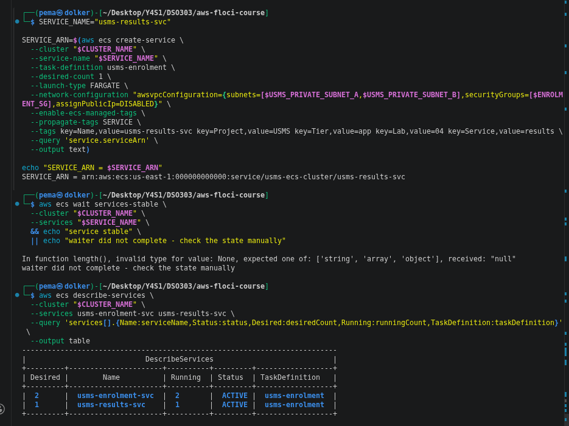
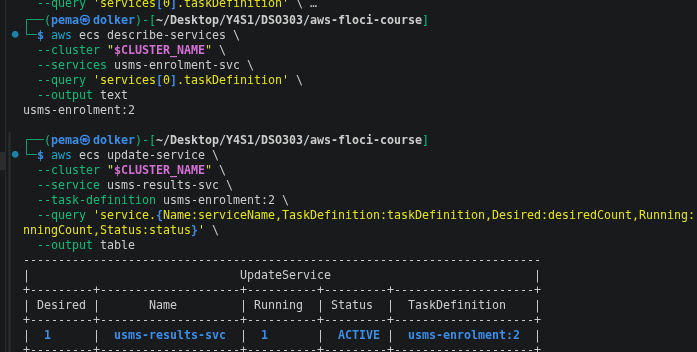
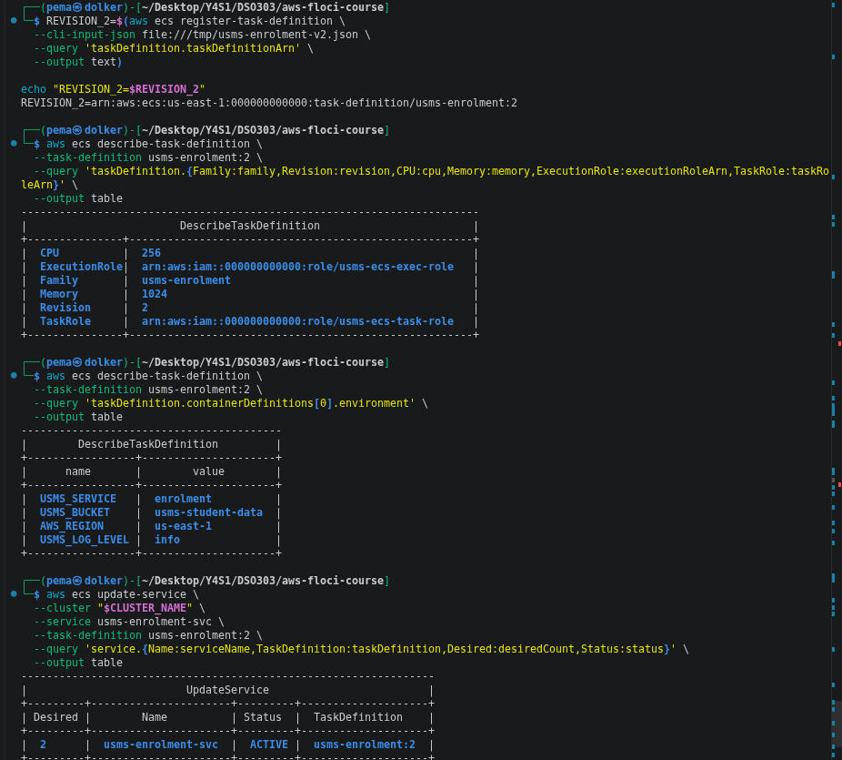
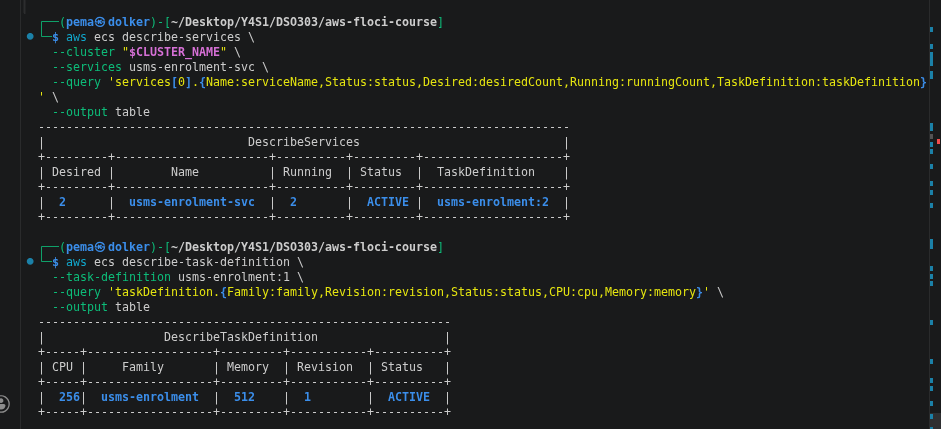
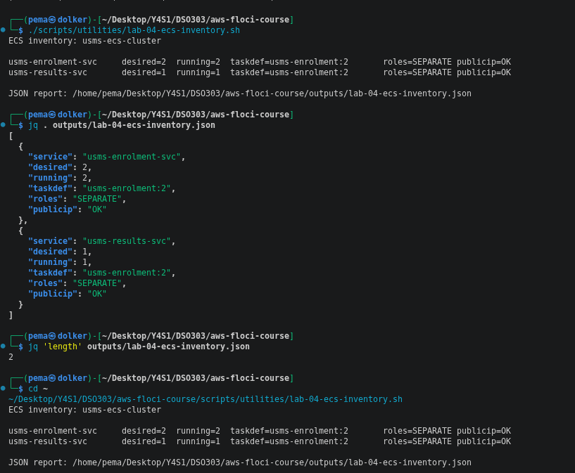
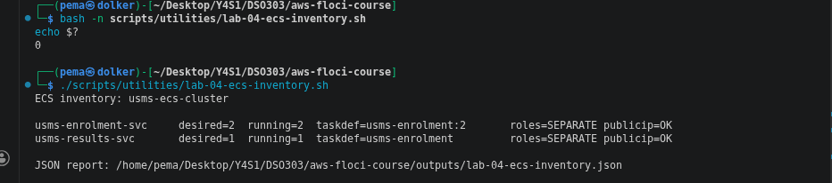
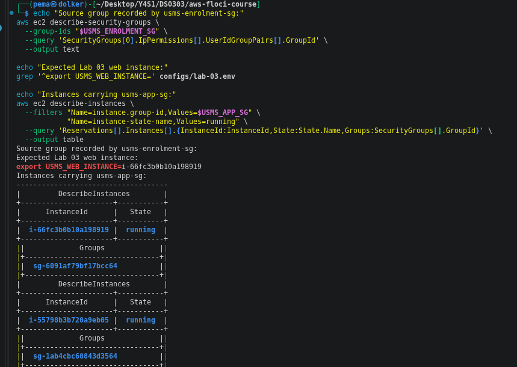
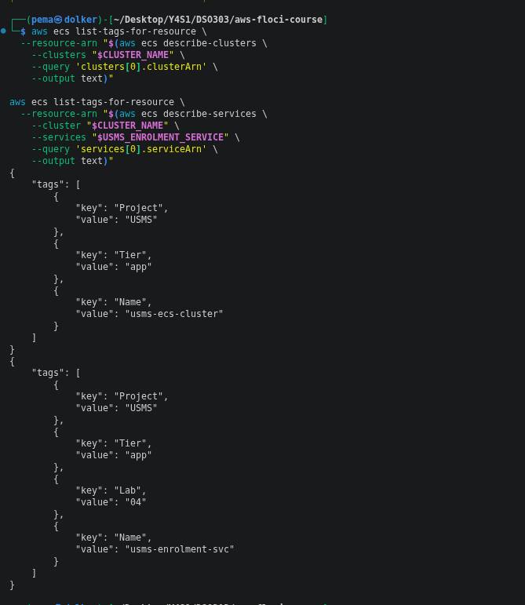

# Lab 04 - ECS Fargate Exercises

## Exercise 1 - Create a second ECS service

I created a second ECS service named `usms-results-svc` in the existing `usms-ecs-cluster`.

The service used the `usms-enrolment` task definition family, had a desired count of 1, used both private subnets, and used `usms-enrolment-sg`. The service was tagged with `Project=USMS`, `Tier=app`, `Lab=04`, and `Service=results`.

The service was later updated to use `usms-enrolment:2`, so both services were using the same task-definition revision before the results service was removed.

---

## Exercise 2 - Register a new task-definition revision

I created revision 2 of the `usms-enrolment` task definition.

The main changes were:

- CPU remained at 256 CPU units.
- Memory was increased from 512 MiB to 1024 MiB.
- `USMS_LOG_LEVEL=info` was added as an environment variable.
- The execution role and task role were explicitly set.
- The task continued to use Fargate and `awsvpc` networking.

The `usms-enrolment-svc` service was then updated from revision 1 to revision 2. After the update, the service had a desired count of 2 and a running count of 2.

Revision 1 was still registered and ACTIVE. This is because task-definition revisions are immutable; changing the service only changes which revision the service uses.

---

## Exercise 3 - ECS inventory script

I created `scripts/utilities/lab-04-ecs-inventory.sh` to inspect all services in the cluster.

The script lists the services first instead of using a hard-coded service name. For each service it reports:

- service name
- desired count
- running count
- task definition
- whether the execution and task roles are the same or separate
- whether a public IP is enabled

The script also creates a JSON report at:

`outputs/lab-04-ecs-inventory.json`

The final inventory showed:

| Service | Desired | Running | Task definition | Roles | Public IP |
|---|---:|---:|---|---|---|
| `usms-enrolment-svc` | 2 | 2 | `usms-enrolment:2` | SEPARATE | OK |
| `usms-results-svc` | 1 | 1 | `usms-enrolment:2` | SEPARATE | OK |

I also ran the script from my home directory to confirm that it works from a different working directory.

**Screenshot placeholder:**  
`[Insert screenshot showing inventory script output]`

---

## Exercise 4 - Enrolment week capacity plan

### Why fixed desired count 2 is not enough

The current `usms-enrolment-svc` has a desired count of 2, but there is no mechanism in the service that reads traffic, CPU usage, memory usage, or the time of day and changes this number automatically.

Therefore, if traffic suddenly increases at 08:03, ECS will still try to keep the desired count at 2. The capacity can only change if a person manually runs an `update-service` command or a future scaling mechanism changes it.

This is why a fixed desired count cannot handle a predictable traffic peak properly.

### Proposed capacity plan

For the Lab 06 scaling design, I would start with:

| Capacity | Proposed value | Reason |
|---|---:|---|
| Minimum | 2 tasks | The current service already runs 2 tasks and spans two private subnets/AZs. |
| Scheduled floor | 8 tasks | Using the lab workload assumption of 200 requests/second and 25 requests/second per task: `200 ÷ 25 = 8` tasks. |
| Maximum | 9 tasks | 8 tasks cover the calculated workload and 1 additional task provides headroom. |

The scheduled floor of 8 should be active shortly before the Monday enrolment peak rather than waiting for the traffic to increase. This is important because a new Fargate task does not become ready instantly.

The maximum of 9 is based on the supplied workload assumption, not on measured production traffic. In Lab 06, the actual maximum should be adjusted after load testing and monitoring.

### Cost considerations

The minimum of 2 keeps the normal cost lower. If the service stayed unnecessarily high, such as 8 or 9 tasks all month, we would pay for capacity that is mostly unused.

If the capacity is too low, the application can become overloaded during the peak. This could cause slower responses or failed requests, which is more serious during the first twenty minutes of enrolment.

For the cost calculation I used the Fargate Linux/X86 rates for US East (N. Virginia):

- vCPU: **$0.04048 per vCPU-hour**
- memory: **$0.004445 per GB-hour**

AWS describes Fargate pricing as being based on the vCPU and memory resources requested by each task.

Revision 2 uses 0.25 vCPU and 1 GiB memory, so one task costs approximately:

`(0.25 × $0.04048) + (1 × $0.004445)`

`= $0.014565 per task-hour`

Using 730 hours as the monthly calculation:

### Option 1 – Today's fixed capacity of 2 tasks

`2 × $0.014565 × 730`

`≈ $21.26 per month`

### Option 2 – Fixed peak capacity of 9 tasks

`9 × $0.014565 × 730`

`≈ $95.69 per month`

Therefore, running 9 tasks continuously would cost about **$74.43 more per month** than keeping 2 tasks continuously, based only on Fargate CPU and memory.

This shows why scheduled scaling is preferable. We can keep the normal capacity low and increase it around the known enrolment period instead of paying for peak capacity throughout the whole month.

These figures exclude other costs such as load balancing, logging, networking, and other AWS services.

**Pricing source:** AWS Fargate Pricing – US East (N. Virginia): https://aws.amazon.com/fargate/pricing/

### What should trigger scaling?

For the future Lab 06 implementation, I would use two types of scaling:

1. **Scheduled scaling** for the known Monday enrolment period. The service should increase its minimum/scheduled capacity before 08:00 and reduce it after the peak.
2. **Metric-based scaling** as a safety mechanism. CPU utilisation, memory utilisation, or an application-level request metric could be used to increase capacity when actual demand is higher than expected.

The scaling policy should aim to keep enough spare capacity so that the service does not wait for new tasks after the traffic has already reached its peak.

### Exercise 1 resource removal

The temporary `usms-results-svc` was removed after the exercise using the ECS service deletion command.

The resource was deleted before the final Lab 04 verification.

### Final verification

The final verification was run using:

`./scripts/utilities/verify-lab-04.sh`

The verifier reported two failures, but both are known benign issues caused by Floci:

1. **Security-group source reference:** Floci did not retain the `UserIdGroupPairs` reference for the intended `usms-app-sg` source. The TCP/80 rule exists, but its source group reference cannot be recovered from Floci.
2. **Git secret check:** the verifier reports the tracked `outputs/.gitkeep` file even though it is intentionally required to keep the outputs directory.

Therefore, these are documented Floci/lab-repository limitations rather than resources that should be deleted to force the verifier to pass.

---

## Exercise 5 - Lab 03 linkage audit

The intended source security group for `usms-enrolment-sg` was:

`usms-app-sg = sg-6091af79bf17bcc64`

The Lab 03 configuration specified the web instance:

`i-66fc3b0b10a198919`

The running instance lookup confirmed that `i-66fc3b0b10a198919` is running and carries `usms-app-sg`.

However, checking `usms-enrolment-sg` showed an empty `UserIdGroupPairs` value. Therefore, Floci did not retain the security-group-to-security-group reference that was intended when the rule was created.

The result is recorded as **MISMATCH – Floci limitation**, rather than claiming that the linkage was successfully verified.

The detailed evidence is stored in:

`outputs/lab-04-lab03-linkage.txt`

The TCP/80 rule is temporary. Lab 05 should remove this temporary linkage once the load balancer becomes the only caller of the enrolment service.

### ECS tag audit

The ECS cluster has:

- `Project=USMS`
- `Tier=app`
- `Name=usms-ecs-cluster`

The `usms-enrolment-svc` service has:

- `Project=USMS`
- `Tier=app`
- `Lab=04`
- `Name=usms-enrolment-svc`

Both ECS resources therefore have the required `Project=USMS` tag.

---

## Conclusion

Lab 04 demonstrated how an ECS Fargate service is connected to a task definition, IAM roles, networking and security groups. I also created a second service, registered a new task-definition revision, and wrote an inventory script to inspect the services.

The capacity exercise showed that a fixed desired count cannot respond automatically to a predictable traffic peak. A combination of scheduled scaling and metric-based scaling would be more suitable for the next lab.

The Exercise 5 audit also showed a limitation of Floci where the security-group source reference was not retained, so the mismatch was documented instead of hiding it.