# Lab 04 Report - Amazon ECS on Fargate

**Course:** DSO303    
 **Environment:** Floci (AWS-compatible emulator, hybrid storage), account `000000000000`, `us-east-1`

**Support path (Step 3):** B - ECS supported, Application Auto Scaling not available. See `notes/lab-04-notes.md`.

> Labels used below:    
**Observed** = I ran it and saw it.        
**Floci limitation** = behaved differently from real AWS.

## 1. Aim

Move the USMS enrolment service onto ECS Fargate inside Lab 02's private subnets: a cluster, a task definition with an execution role and a task role, a security group sourced from the web tier, and a service with desired count 2 across two Availability Zones. Auto scaling is left to Lab 06.

## 2. Environment and prerequisites (Steps 1-3)

Floci was started with `floci-up.sh` (storage mode hybrid) and `course.env` plus `lab-01` to `lab-03` env files were sourced. `whoami.sh` confirmed account `000000000000`.

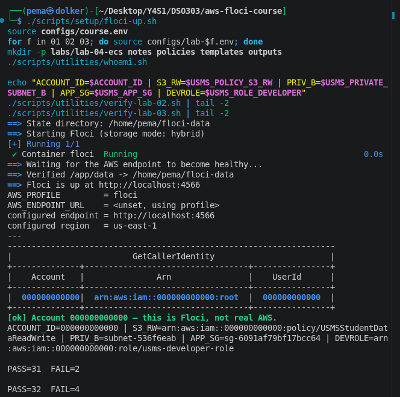

**Observed:** `verify-lab-02.sh` gave PASS=31 FAIL=2 and `verify-lab-03.sh` gave PASS=32 FAIL=4, not the FAIL=0 the lab expects. These failures come from earlier labs and I did not repair them here. The failing checks are already documented in my Lab 02 and Lab 03 notes and are the same known Floci limitations.

Step 3 probe:

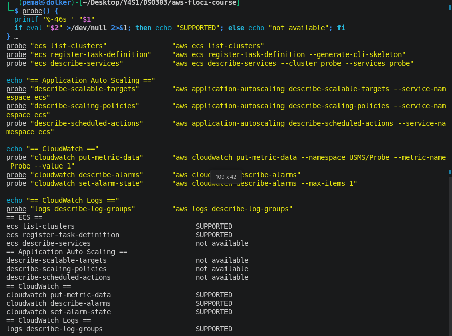

**Observed:** ECS calls, CloudWatch and CloudWatch Logs answered. All three `application-autoscaling` calls were "not available", so I am on **Path B**. `describe-services` showed "not available" only because the probe names a cluster that does not exist.

## 3. Cluster (Step 4)

I assumed `usms-developer-role` before creating the cluster. Before the assume-role, the `usms-dev` profile identified as `user/usms-dev-01`; after exporting the temporary credentials, the caller was the assumed role.

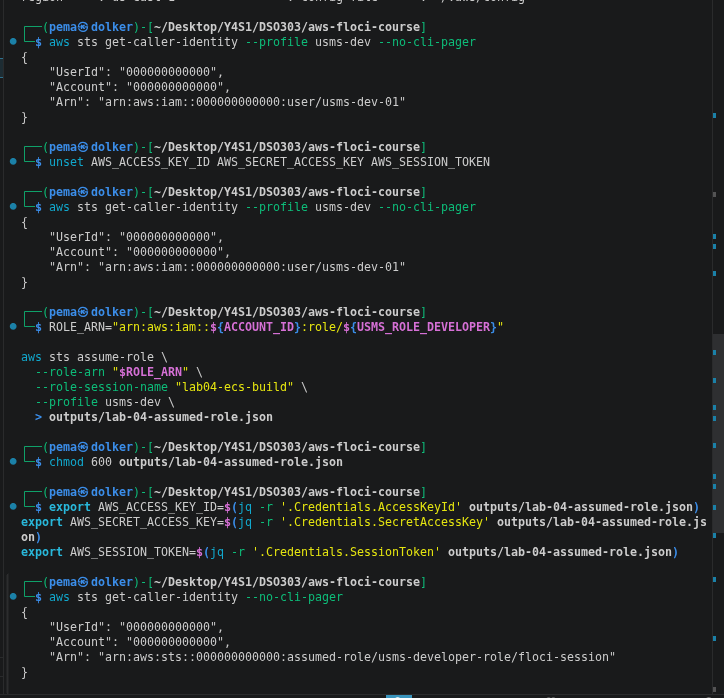

**Floci limitation:** the session name I passed (`lab04-ecs-build`) was ignored and the ARN ended in `floci-session`. The role assumption worked.

Cluster created, credentials unset, and cluster read back:

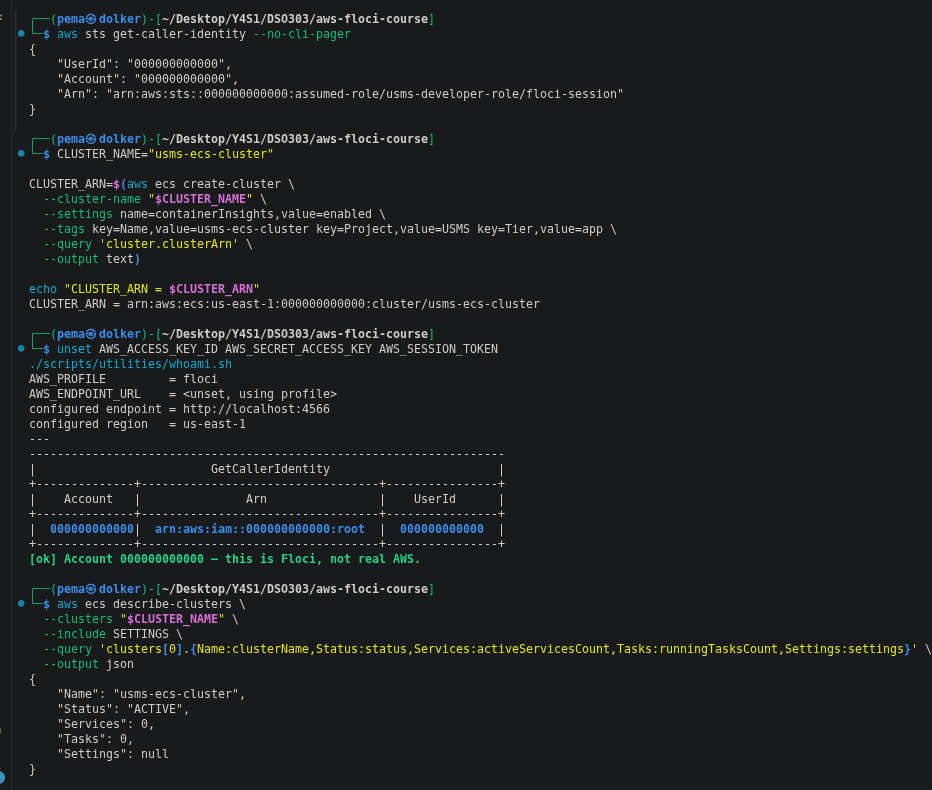

**Observed:** status ACTIVE, 0 services, 0 tasks. **Floci limitation:** `Settings` came back `null`, so `containerInsights` was not stored. On real AWS it would be, and Lab 06's target tracking depends on the CPU metric it publishes.

## 4. Log group (Step 5)

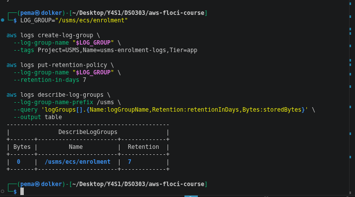

**Observed:** `/usms/ecs/enrolment` exists with retention 7 and 0 bytes stored. Retention is a separate call because `create-log-group` has no retention option.

## 5. IAM roles (Steps 6 and 7)

Execution role with the least-privilege `USMSECSTaskExecution` policy (ECR pull, and log writes to one log group only):

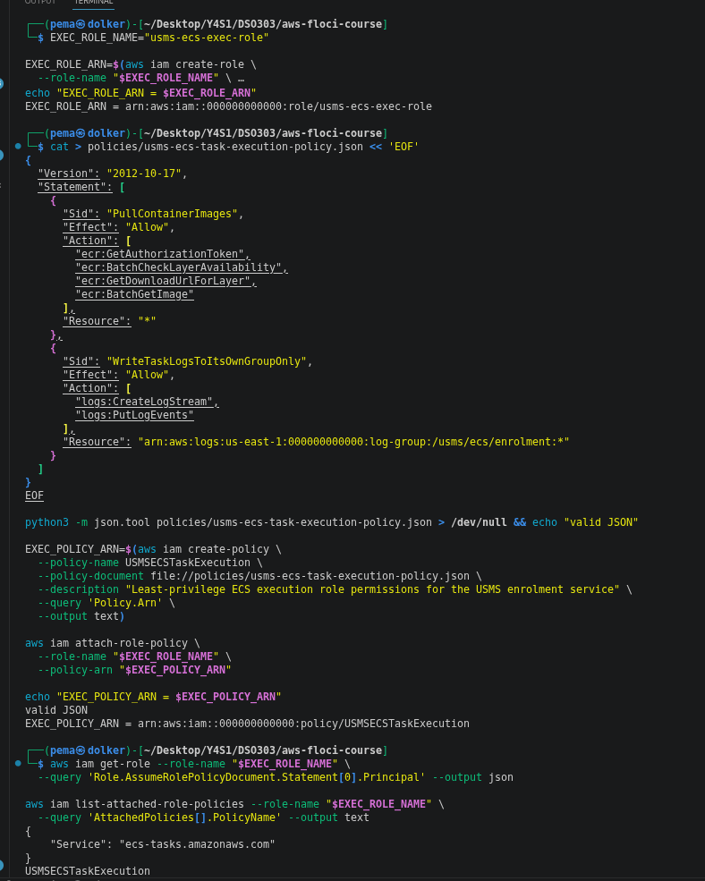

**Observed:** the principal is `ecs-tasks.amazonaws.com` and the attached policy is `USMSECSTaskExecution`.

Task role, reusing Lab 01's policy unchanged:

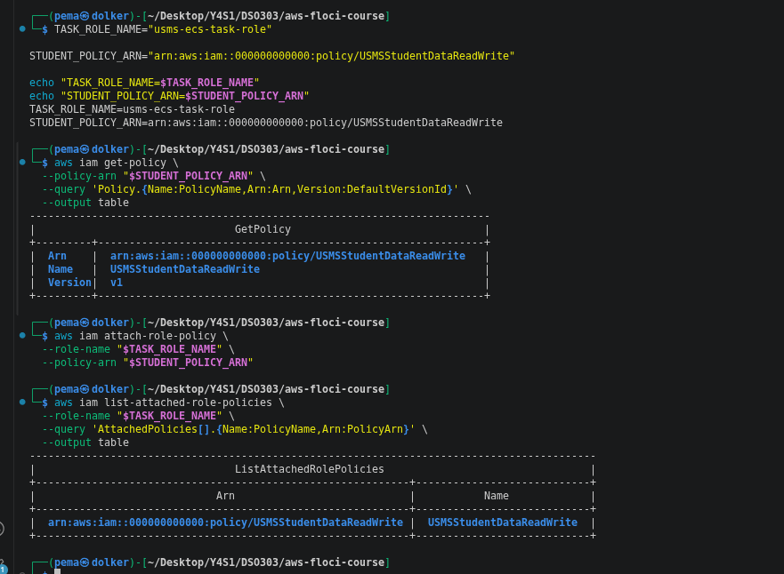

**Observed:** `usms-ecs-task-role` carries `USMSStudentDataReadWrite`, version v1. The same policy is now on `usms-ec2-app-role` (Lab 03) and this task role, delivered by two different mechanisms. The bucket still does not exist, so neither chain can be exercised yet. **Floci limitation:** task containers cannot fetch role credentials, which I reasoned about rather than tested.

## 6. Security group (Step 8)

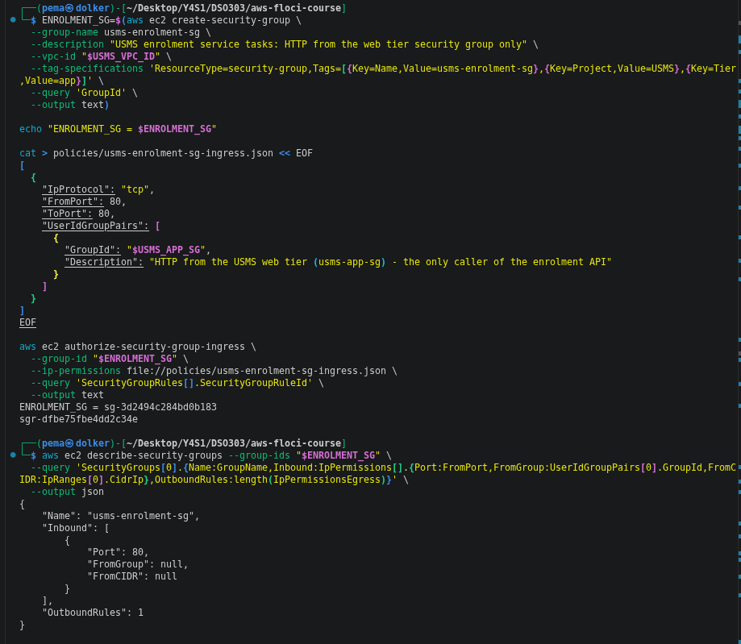

**Observed:** `usms-enrolment-sg` created, an ingress rule on TCP/80 authorised, one outbound rule.
**Floci limitation:** the read-back showed `FromGroup: null` and `FromCIDR: null`. The rule was created from a file with `UserIdGroupPairs` pointing at `usms-app-sg`, but Floci did not return the source group. I recorded this instead of rewriting the rule as a CIDR, which would defeat the purpose of the step.

## 7. Task definition (Step 9)

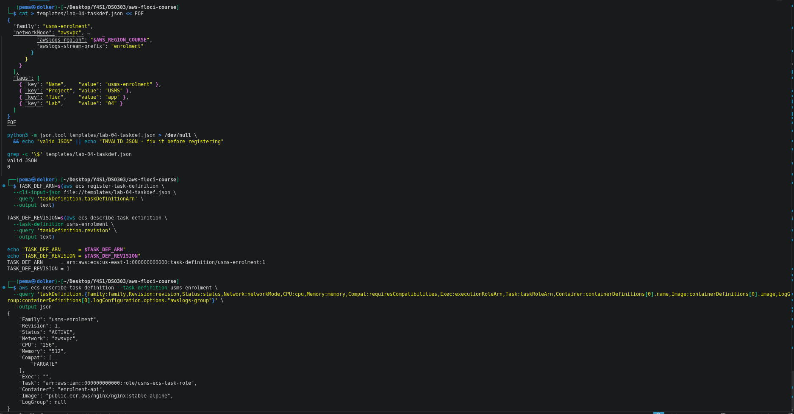

**Observed:** `usms-enrolment:1` registered, ACTIVE, awsvpc, FARGATE, 256 CPU / 512 MiB, container `enrolment-api`, and the `grep -c '\$'` check printed 0.
**Observed, and worth flagging:** in this read-back `Exec` is an empty string and `LogGroup` is `null`, while `Task` shows the task role ARN. The lab expects two different ARNs here. Note that the `grep -c '\$'` check cannot catch an empty variable, since it expands to nothing and leaves no `$` behind. Revision 2 (Exercise 2) set the roles explicitly. 

## 8. Service (Steps 10 and 11)

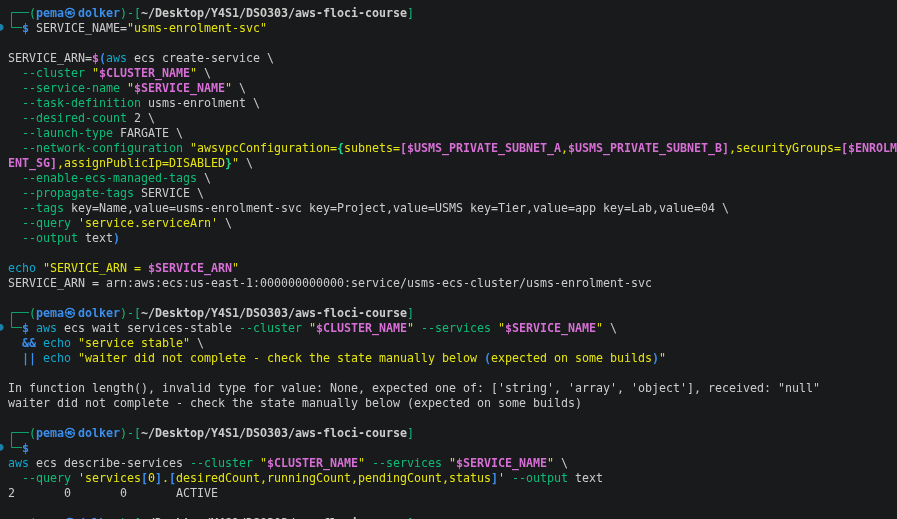

**Observed:** service created; the ARN ends `service/usms-ecs-cluster/usms-enrolment-svc`, the form Lab 06 will need. Immediately afterwards `describe-services` showed desired 2, running 0, pending 0, ACTIVE.
**Floci limitation:** `aws ecs wait services-stable` failed with `In function length(), invalid type for value: None`, so I fell back to manual `describe-services`, as the lab allows.

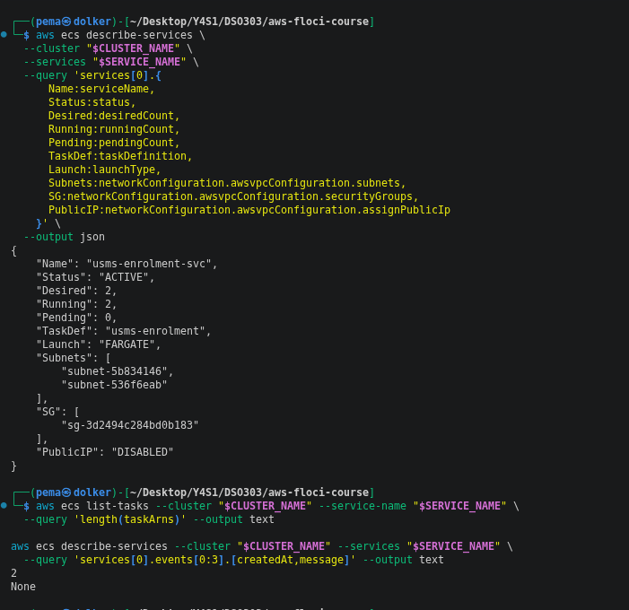

**Observed:** desired 2, running 2, pending 0, FARGATE, both private subnets, security group `usms-enrolment-sg`, `assignPublicIp` DISABLED, and `list-tasks` returned 2. **Floci limitation:** the service `events` list printed `None`, so the service's own narration was not available. The service's `taskDefinition` shows the family name only.

### "Your turn": manual capacity change

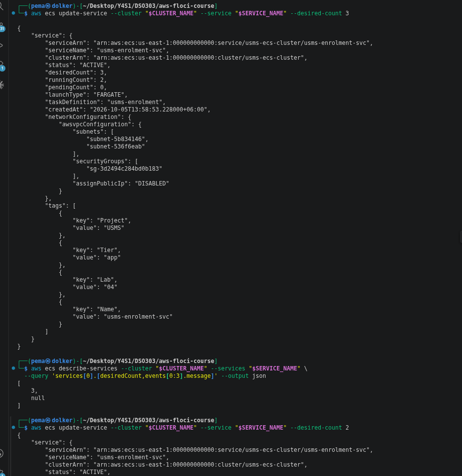

**Observed:** `update-service --desired-count 3` returned `desiredCount: 3` while `runningCount` was still 2, then `--desired-count 2` was sent to set it back. **Floci limitation:** the events list returned null, so there was no narration of the change. On real AWS a third task would start within 20-60 seconds. 

## 9. Recording outputs (Step 12)

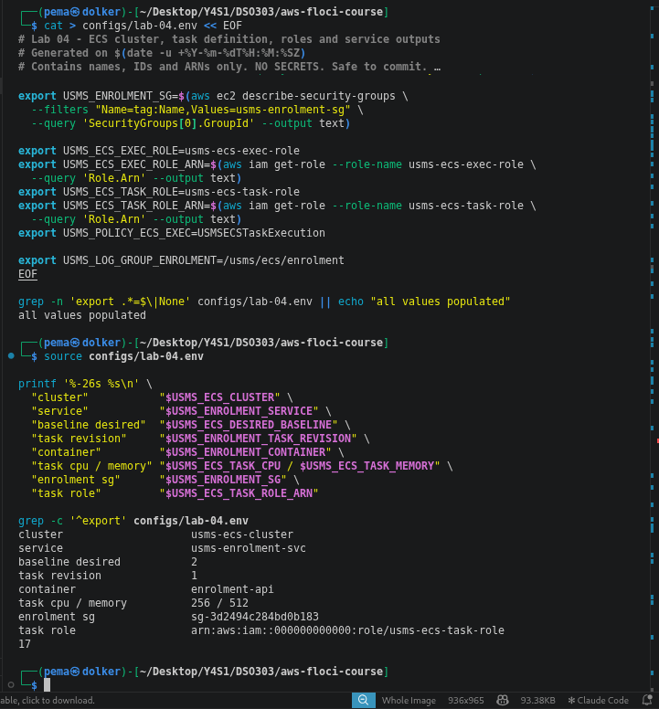

**Observed:** all values populated, 17 exports, baseline desired 2, task revision 1, container `enrolment-api`, 256 / 512, and the enrolment security group and task role ARN resolved by lookup.

## 10. Git commit (Step 13)

## 11. Verification (Section 9)

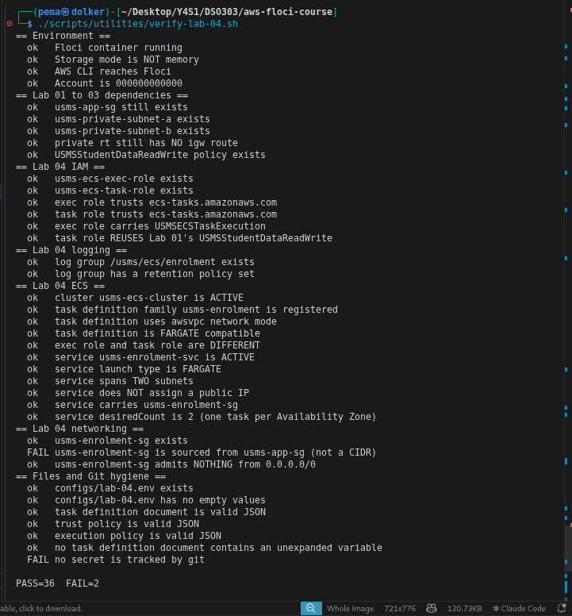

**Observed:** PASS=36 FAIL=2. Both failures are documented benign issues:

| Failed check | Reason |
|---|---|
| `usms-enrolment-sg is sourced from usms-app-sg` | Floci does not retain `UserIdGroupPairs` (Section 6). The TCP/80 rule exists. |
| `no secret is tracked by git` | The check `git ls-files \| grep '^outputs/'` also matches the intentionally tracked `outputs/.gitkeep`. The check is too broad; no secret is tracked. |

I did not delete `.gitkeep` or recreate the security group to force FAIL=0. One caution: on revision 1 the check "exec role and task role are DIFFERENT" passed even though `Exec` printed empty (Section 7), because an empty string differs from any ARN.

## 12. Exercises

Exercises 1 to 5 are in `labs/lab-04-ecs/exercises.md`. The Exercise 5 linkage file records `MISMATCH`: the instance carrying `usms-app-sg` is the same as `$USMS_WEB_INSTANCE`, but Floci's missing source reference prevents a `LOOP CLOSED` verdict.

## 13. Conclusion

I built the ECS layer for the enrolment service: cluster, log group, two separate IAM roles, a security group, a task definition and a service of two Fargate tasks in two private subnets. The key ideas were that the service's `desiredCount` is the only thing that will ever change when scaling is added, and that Lab 01's policy works unchanged on a second kind of compute. Several Floci differences were recorded rather than worked around: no Container Insights setting, no stored security group source reference, a failing waiter, no service events, and no Application Auto Scaling. Lab 06 will need its documented fallback for the last of these.