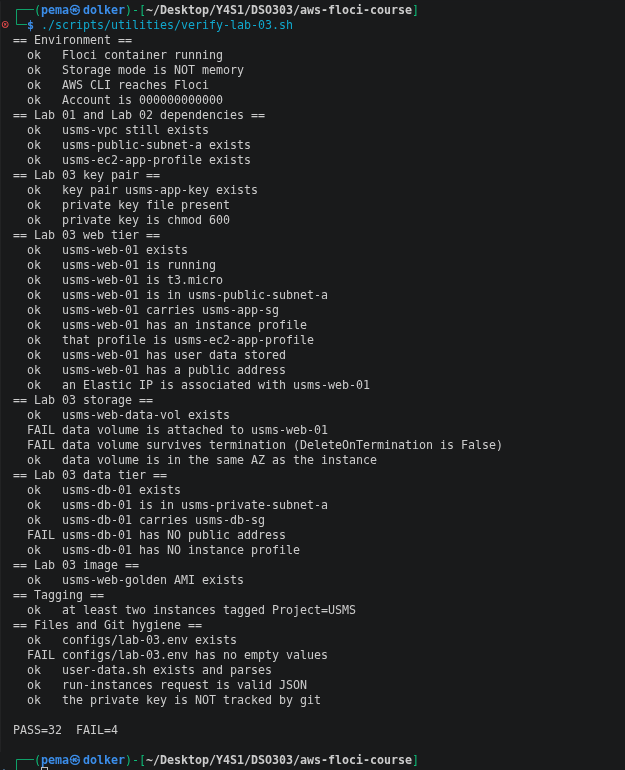
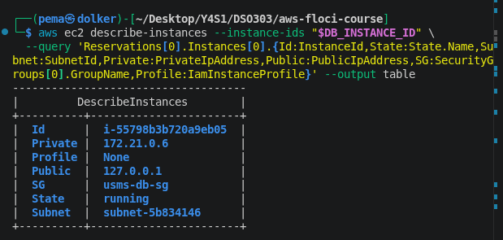
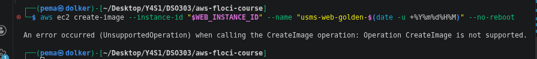
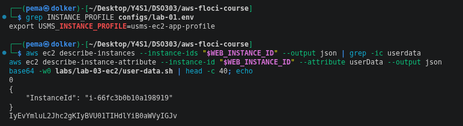
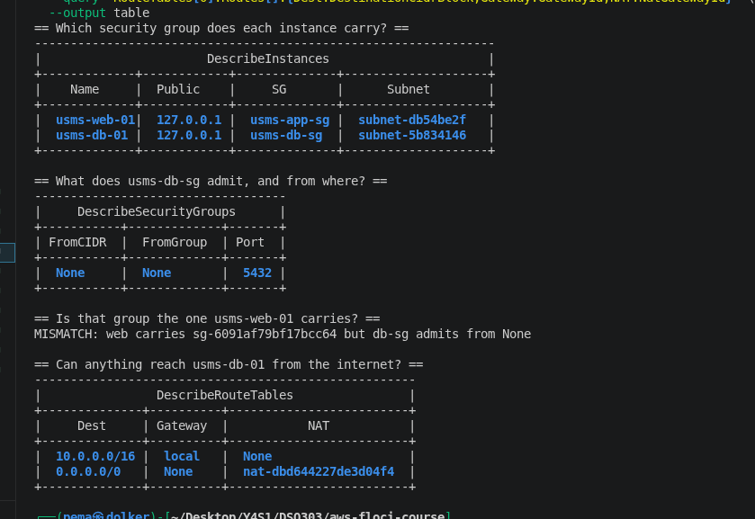
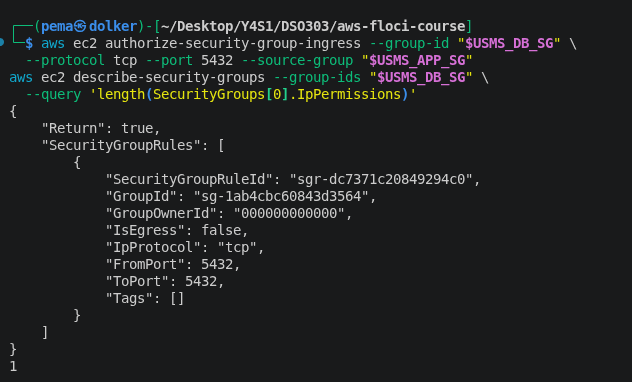
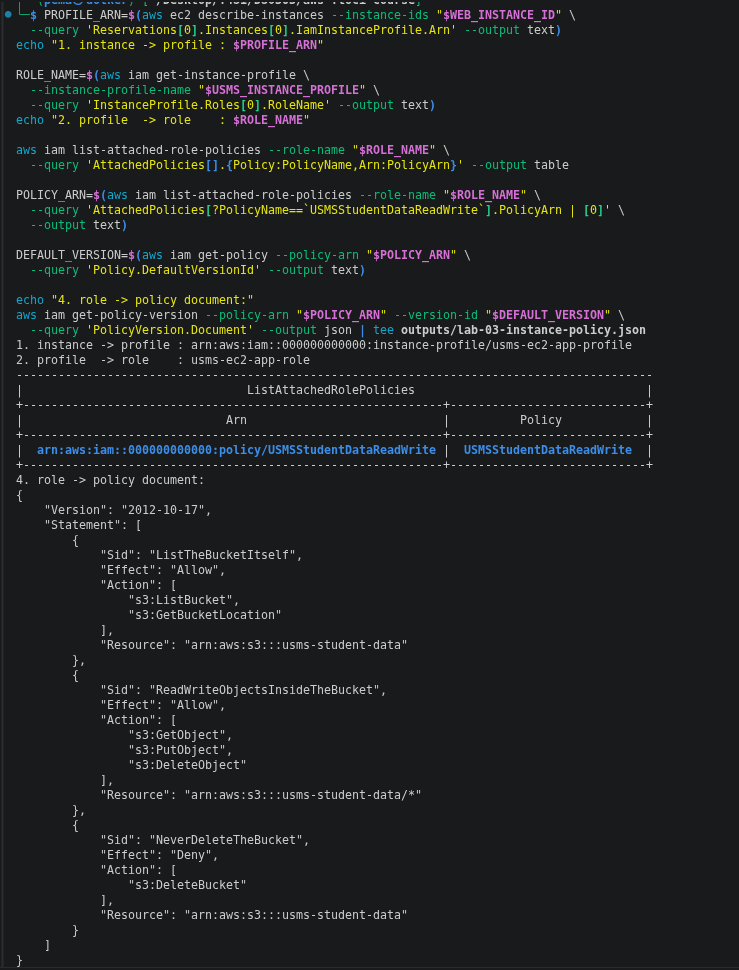
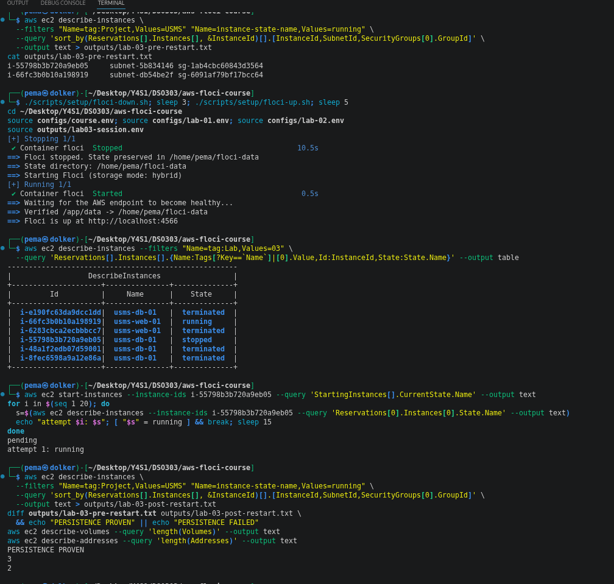

# Lab 03 Notes: EC2

`verify-lab-03.sh` finished at **PASS=32 FAIL=4** (the lab expects FAIL=0).
All four failures trace back to this Floci build, not to my configuration,
and two other checks pass for the wrong reason. Both are explained below,
followed by the seven review questions.

## Floci limitations I hit

- **Data volume never attaches.** `attach-volume` returns
  `UnsupportedOperation`. The volume itself (`usms-web-data-vol`, 8 GiB
  gp3) is created correctly, in the right AZ, but `Attachments` stays
  empty. That's why "data volume is attached" and "DeleteOnTermination is
  False" both fail - there's no attachment for either check to read.

  

- **No AMI gets created.** `create-image` also returns
  `UnsupportedOperation`, so `usms-web-golden` doesn't exist and
  `USMS_WEB_AMI=None` in `configs/lab-03.env` — which is why "no empty
  values" fails. I left the `None` in rather than editing around it.
  The verify script's "golden AMI exists" check still shows a PASS, but
  that's a false pass: Floci accepts `describe-images --image-ids None`
  without error, so the check doesn't actually prove an image exists.

  

- **User data is stored but not returned.** `describe-instance-attribute
  --attribute userData` gives back only the instance ID, no `UserData`
  field at all. I can show the CLI correctly base64-encoded my script on
  the way in (the first bytes decode to `#!/bin/bash`), but I can't show
  the round trip the lab asks for — there's nothing on the read side to
  diff against. The verify script's "has user data stored" check still
  passes, but that's also a false pass: it's just testing that the
  returned string isn't empty, and an empty JSON object still isn't
  empty as a string.

  

- **The private instance still shows a public address.** `usms-db-01`'s
  subnet has `MapPublicIpOnLaunch=False` — I checked the subnet attribute
  directly - but the instance still reports `PublicIpAddress=127.0.0.1`.
  That's a loopback placeholder Floci seems to put on every instance
  regardless of subnet, not a real public address. The subnet
  configuration is correct; only the reporting is wrong.

  

- **Private addresses aren't inside the VPC's CIDR at all.** Both
  instances report private IPs like `172.21.0.3`–`172.21.0.6`, which is
  Floci's own Docker network range, not `10.0.1.0/24` or `10.0.3.0/24`
  as the lab's "expected result" shows. Worth flagging on its own —
  it's a bigger gap than just the public-IP placeholder, since it means
  the private-IP field can't be used to confirm subnet placement at all;
  `SubnetId` is the only field that actually proves it.
- **Security-group group-references don't persist**, the same bug from
  Lab 02: `usms-db-sg`'s rule correctly names `usms-app-sg` as its
  source when I create it, but reading it back shows `FromGroup: None`.
  Finding the identical gap a third time, on a new rule in a new lab,
  rules out it being one bad rule — it's how Floci stores
  `UserIdGroupPairs` in general.

  

- **Extra instances fail to launch at all.** Both Exercise 1's admin host
  and Exercise 2's `usms-db-02` went from `run-instances` straight to
  `terminated`. The Docker logs behind Floci show why: each instance gets
  its own container with a published host port, and the port was already
  taken —
  `Bind for 0.0.0.0:2201 failed: port is already allocated`.
  So this isn't a quota or config issue, it's Floci running out of free
  host ports for new containers.

  

- **Not observable at all, reasoning only:** nginx actually running, the
  user-data script executing, the instance fetching credentials from the
  metadata service, and a security group actually blocking a connection.

A couple of smaller things I noticed but didn't independently verify with
a screenshot, so I'm noting them as observed-once rather than confirmed:
`delete-key-pair` returning success without the key actually being
removable (`create-key-pair` afterwards said `InvalidKeyPair.Duplicate`),
and one instance appearing to hold two associated Elastic IPs at once,
which real AWS wouldn't allow.

## Checkpoints

**Checkpoint 3** - permission chain traced, user data sent (not provably
round-tripped, see above):

**Checkpoint 5** - two-tier wiring:

**Checkpoint 6** - persistence across a Floci restart:

## Review questions

**1. Step 8: what if each of the five inputs had been wrong or missing?**
A wrong subnet or security group fails immediately —
`InvalidSubnetID.NotFound` / `InvalidGroup.NotFound`. A missing instance
profile or key pair also fails immediately, for the same reason: the API
checks that the named object exists before it will launch anything. The
quiet one is the user-data script — if it has a bug, `run-instances`
still succeeds, and the failure only shows up later when nginx isn't
running, because it failed at boot and by then you may not even be able
to log in to check why. A wrong security group *rule* (not a missing
group, but a rule that's scoped incorrectly) fails quietly in a different
way: the instance launches fine, you just can't reach it, and nothing
tells you that's the reason.

**2. Why is the policy valid when the bucket doesn't exist, and what
changes when it's created?**
An IAM policy is a statement about an ARN pattern, not a reference to a
live object — it says "allow these actions on
`arn:aws:s3:::usms-student-data`" and IAM never checks whether anything
actually exists at that ARN before deciding whether to allow a request.
Today `usms-web-01` already has the permission; there's just nothing to
use it on, which is why my `head-bucket` call returned a 404. The moment
Lab 4 creates the bucket, the permission starts working immediately — the
policy, the role, the instance profile, and the instance don't change at
all. And because this runs through the instance profile, there's never an
access key sitting on the server to begin with.

**3. User data only runs once — why doesn't "restart to redeploy" work,
and what does?**
`cloud-init` runs user data exactly once, at the instance's first boot. A
stop/start cycle, or any later reboot, doesn't trigger it again, because
cloud-init tracks that it already ran for that instance ID. Two things
that do work: bake the deployed app into an AMI and launch new instances
from it (what Step 20 is for), or have a separate mechanism — a systemd
unit or cron job — that pulls the latest version on its own schedule,
independent of whether the instance ever reboots.

**4. Auto-assigned public IP vs. Elastic IP.**
The auto-assigned address comes from a pool AWS owns, is free, belongs to
the instance only while it's running, and is replaced with a different
one every time the instance stops and starts. An Elastic IP is owned by
my account, stays allocated until I release it, survives a stop/start
unchanged, and costs money the moment it's allocated but not attached to
a running instance. Because the Elastic IP's identity is separate from
any one instance, I could move it from a failed instance to a standby
during a failover and nothing pointing at that address — DNS included —
would need to change. (On this Floci build I couldn't actually watch the
auto-assigned address disappear on stop — the field just stayed
`127.0.0.1` throughout — so that specific behaviour is reasoned from the
lab text rather than something I observed.)

**5. EBS volumes vs. snapshots across Availability Zones.**
A volume lives in one AZ's own storage fabric, so it can only attach to
an instance in that same AZ. A snapshot is stored at the regional level,
so it can be restored into a new volume in any AZ in the region. For a
system that needs to survive losing an AZ, that means a single volume is
never enough on its own — you need either regular snapshots so a volume
can be rebuilt elsewhere after an outage, or a design that replicates the
data across AZs at the application layer instead of depending on one
volume. (`attach-volume` doesn't work on this build, so I couldn't test
this directly — this answer is reasoned from the lab text.)

**6. Is the six-property check an adequate substitute for actually
testing with curl?**
Mostly, but not completely, and it's worth being precise about which part
it covers. The six checks are the real, ordered dependency chain a
request has to clear — instance running, route to an internet gateway,
gateway attached, security group open, a public address present, NACL
permissive — so if any one of them is wrong, that's a genuine,
fixable problem the checklist catches. What it structurally cannot see is
the seventh link: whether a process is actually alive and listening on
the port. A crashed app, a broken nginx config, or a user-data script that
failed partway through would all pass every one of the six checks and
still be completely unreachable. My own `curl` timed out for exactly that
reason — Floci boots no operating system at all — which is the same class
of fault the checklist can't catch, just for a different underlying cause.

**7. Every difference between `usms-web-01` and `usms-db-01`.**
Both are `t3.micro` from the same AMI, so every difference comes from
placement and configuration, not the machine itself.
- **Instance-level** (chosen per launch): the instance profile (web has
  one, db has none), the security group attached (`usms-app-sg` vs.
  `usms-db-sg`), the key pair and tags, and the user-data script (only
  the web instance got one).
- **Subnet-level** (inherited, not chosen by the instance): whether a
  public address gets assigned at all (`MapPublicIpOnLaunch`), and which
  route table applies — the public subnet's route table points at the
  internet gateway, the private subnet's points at the NAT gateway. The
  NACL attached to each subnet is also a subnet-level property.
- **VPC-level** (shared by both, not a difference at all): the
  `10.0.0.0/16` address space, and the internet gateway and NAT gateway
  that the two route tables point to — both instances sit inside the same
  VPC, so this layer is identical for both.